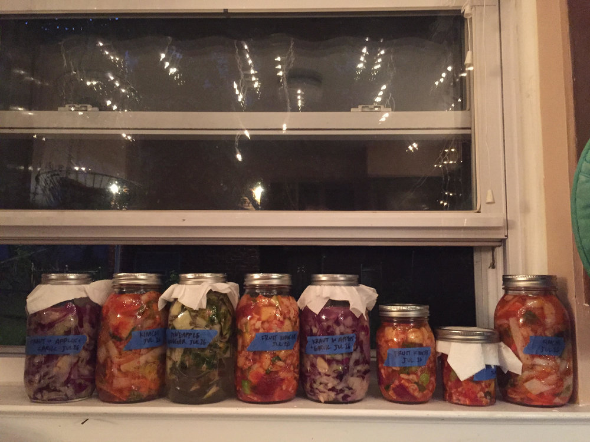
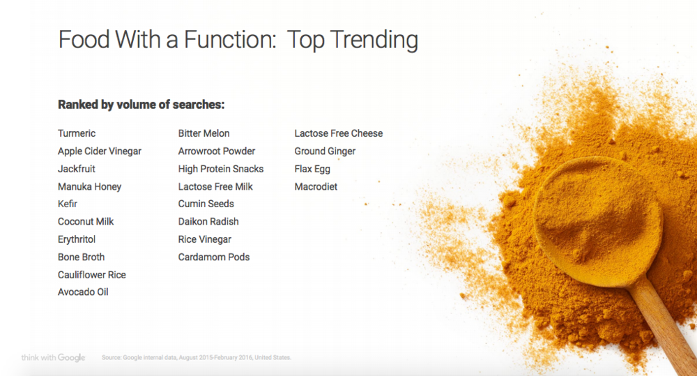
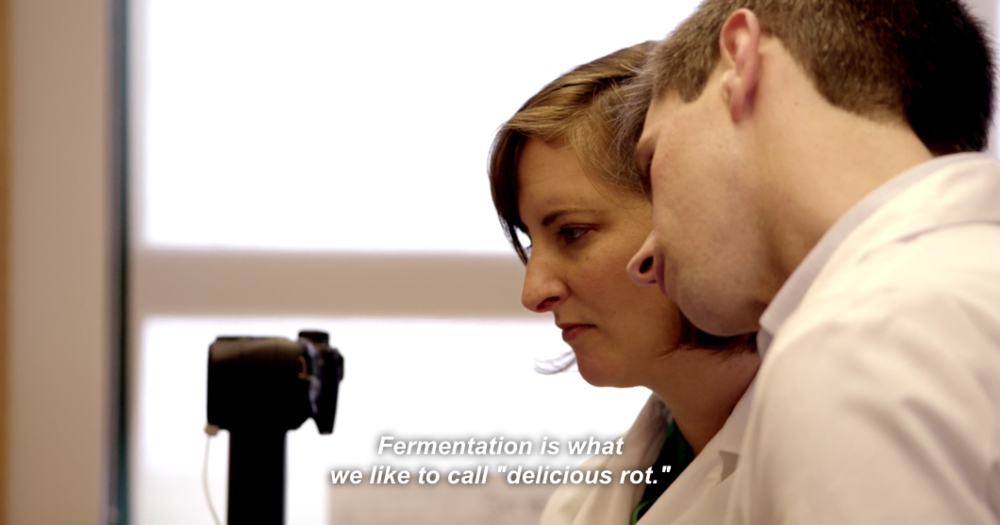

There are too many mason jars in my kitchen. In glass containers of variable sizes, diced beets stew in their own ruby-red brine and pink jellyfish-like slabs buoyed by bacteria float in tea. The sulfuric smell radiating from the corner is shredded cabbage suspended in liquid, bubbling its way toward sauerkraut. Bugs are hard at work in my kitchen, I'm told, and though I can't see them, I can see their vestiges: foam, bubbles, kahm yeast. These are good signs. Something, at least, can benefit from the underventilated humidity my home has to offer.

Why am I eating what I'm eating? Fermentation casts a strange existential shadow over what's generally an intuitive non-question in my life. I try to find a fair compromise between Tastes Good (definitive) and Is Good (constantly being thrown into question) in the foods that comprise my daily diet. While cringing through a batch of homebrewed kombucha that tasted like pure vinegar recently, though, I laughed in spite of myself. Why drink it? Why not clean my sink with it instead?

I'm certainly more willing to compromise on taste when it comes to foods with associated health benefits, but with fermented foods it's sometimes unclear where I draw that line. Since my foray into fermentation began, I've been searching for a grand unified theory on the phenomenon: not the mechanisms of the process itself, but why it's currently popular. Between the sliminess, the sour smells, the sharp tastes, and the implications of death and decay, fermentation invites the question of why we are expending resources, in various ways, for bugs in our food.

My kitchen, July 2016: sauerkraut, pineapple vinegar, cabbage kimchi, and fruit kimchi.

*Fermentation isn't a trend* is the rallying cry of the many food blogs insistent that this method has been practiced since ancient times. And though it's true—as a practice, fermentation is age-old—it is also a trend, and only made trendier by its ancientness. The process itself hasn't changed much; essentially, without the application of heat, microorganisms break a substance down into a simpler substance. What has changed, however, is the shift of fermentation's appeal into the territory of contemporary consumption, wherein the more a food product can do for our bodies beyond eliminating hunger, the better.

Fermentation seems both the antithesis and the mirror image of the [raw food movement](https://en.wikipedia.org/wiki/Raw_foodism). Both trends do away with conventional forms of cooking; devotees of both underscore the importance of holistically healing oneself through the consumption of nutrients allegedly destroyed by sauteeing, baking, frying, or steaming. But the appeal of fermentation seems to be the transformation of raw material into something else, the murky area that raw food enthusiasts avoid in favor of unaltered, "pure" food.

In the four-part Netflix adaptation of his most recent book *Cooked,* Michael Pollan dedicates an entire episode to the process and byproducts of fermentation. In this episode, as he massages cabbage into kimchi, Pollan describes what might be the better-than-raw ethos behind fermentation's current moment. Not only does fermentation preserve the food in question (cabbage, in this case), "it actually improves the food," says Pollan. "The bacteria in the fermentation are producing vitamin B12, for example. There's lots of vitamin C when you make sauerkraut or kimchi. So you actually end up with a substantially more nutritious food than you had before, and we have the bacteria to thank for that." Like Uber, but for intestinal health.

Fermentation, then, finds a way to deliver both on the promises of the raw-food movement—food is healthiest when consumed as it's found in nature—and on the pharmaceutical impulse behind making foods work for us as rigorously as possible. The timing seems to be right for this double-bind: [Google's Food Trend Report](https://www.thinkwithgoogle.com/articles/2016-food-trends-google.html) both observed and portended "the rise of functional foods" in 2016. As they announced the meteoric rise of turmeric and jackfruit and the fall of bacon cupcakes and the rainbow bagel, Google pointed to millennials' investment in self-improvement through the consumption of healthy foods:

_A number of the top trending foods over the last two years are "healthy" ingredients like turmeric, apple cider vinegar, avocado oil, bitter melon, and kefir (high in trendy bacteria called probiotics). They are said to infer benefits like better skin, libido, and energy or cures for depression, insomnia, and pain (in fact, "benefits" is a term that's commonly searched for along with many of these foods)._

I'd like to scoff at the logic that places turmeric, avocado oil, and kefir squarely in the category of "functional," effectively suggesting everything else we eat is merely indulgent or biologically useless. But over the past two years, as I've produced and consumed fermented foods at an ever-increasing rate, I'm sure I participate in that same logical scheme. [A 2009 report in WIRED](https://www.wired.com/2009/02/bacteriablood/) stated that "imbalances in gut bacteria have already been linked to obesity, cancer, asthma, and a host of autoimmune diseases," and probiotics—the microorganisms found in yogurt, kombucha, kimchi, and all manner of fermented foods—serve a regulatory function in the gut to counteract these imbalances. With no real way to know what's in fermented foods made at home, there's a resource-heavy bet at play that these foods are, in fact, doing something good for our bodies. There is faith in functionality.

A slide from Google's 2016 Food Trend Report.

In Google's analysis of "functional foods" and their popularity, the reader can infer the narrowness with which functionality is defined. It is an inward-facing phenomenon: foods gain their functionality in their ability to address any number of issues that stem from embodiment. Never mind the practical concerns: bottled kombucha, for instance, is prohibitively expensive; the homebrewed variety can take up to a month to make, sometimes tastes awful, sometimes is poisonous, and always requires the handling of slimy bacterial culture. Functionality and practicality or feasibility are pushed to separate corners of this discussion.

Historically, fermentation has existed in service of the preservation of food; good nutrition or good taste were secondary or incidental. For those for whom fermentation is a twenty-first century trend, however, its role as a means of preservation without the application of heat has never been primary. It is not an environmental functionality or a practical survivalist impulse that has animated fermentation's resurgence, but a deep investment in bodily health and a quasi-religious faith in probiotics as a panacea.

In [_The Art of Fermentation_](http://www.wildfermentation.com/the-art-of-fermentation/) by Sandor Katz, the seminal text on all things fermented, Katz presents extensive how-tos, advice, and troubleshooting for at-home fermentation against the backdrop of rampant consumer demand for their mass-produced counterparts. Katz (a self-proclaimed "fermentation revivalist" and a queer AIDS survivor who credits fermented foods in no small part for his recovery) writes in his 2012 book that "no other ferment even approaches kombucha in terms of its sudden dramatic popularity (at least in the United States)...*Newsweek* reports that between 2008 and 2009, US kombucha sales quadrupled, from $80 million to $324 million."

Katz insists that at-home fermentation is perfectly safe, so long as the practitioner is thorough in cleanliness and takes precautionary measures. He describes the widespread worry over the safety of fermenting foods at home, the perceived health risks of which certainly help to animate the booming commercial kombucha business. "In our cultural collective imagination," writes Katz, "the food safety threat that looms largest is botulism, the rare but often deadly neurological disease caused by *botulinum,* 'the most poisonous substance known to humans.'" Though the the growth of botulism and other health threats through fermentation practices is rare, as Katz assures us, the dark cloud of cultural imagination is a barrier to entry in and of itself.

If there's one main takeaway from Katz's contribution to fermentation revival, moreover, it's that fermentation is a hobby with a massive learning curve. The knowledge and materials required for successful ferments are specialized, even under the guidance of Katz, who harbors clear disdain for single-use gadgets. *The Art of Fermentation* is close to 500 pages long, and each section feels necessary. Katz's writing makes obvious that engaging in the practice of fermentation isn't so much about following recipes as undergoing a paradigm shift in one's relationship to food and following the messy path of experimentation where it may lead you.

The so-called age of functional foods, then, is distinctively marked by the material and immaterial luxuries that underwrite biological functionality: time, knowledge, patience, sometimes difficult-to-find ingredients, and the willingness and ability to sacrifice these luxuries to the process of failing over and over again before succeeding. Functional for whom?

My kitchen, April 2016: a lively ginger bug (ginger, sugar, water) that's used as the wild yeast base for recipes like ginger beer and fermented lemonade.

In "Earth," the fermentation episode of Michael Pollan's *Cooked* series, Pollan tells us that of all our various methods of preparing food, "fermentation is the most miraculous, and the most mysterious." Speaking breathily, eyes twinkling, Pollan diligently guides us through a litany of foods we may not know are made possible through fermentation, from kimchi and beer to chocolate and cheese. "The word ferment, which means to boil, is really kind of appropriate," says Pollan, "because this liquid that was kind of inert is suddenly bubbling."

It is easy to share in Pollan's enthusiasm when one has created sauerkraut out of "inert" cabbage and salt, or sourdough starter from flour and water. It really is a captivating process, especially for someone raised in America with an extremely corporate conception of the genesis of most foods. Pollan's fermentation mysticism is strikingly reminiscent of another recent ancient-but-trendy western food revelation: umami.

In the past sixteen years in particular, since the discovery of a glutamate taste receptor—which translates the tastes we understand as umami to the brain—in 2000, there has been intermittent interest in this "fifth taste." A basic component of how we understand the complexity of flavor, umami joined the ranks of sweetness, sourness, bitterness, and saltiness, albeit a bit later than those four tastes. Michael Pollan's wide-eyed wonder at the little bugs that transform tea into kombucha was echoed in the fascination over the discovery of umami: "did you know there's a _fifth_ taste?"

In 2007, the host of NPR's Morning Edition [dubbed umami the "forbidden taste,"](http://www.npr.org/templates/story/story.php?storyId=15819485) though the episode proceeded to describe the ways in which we already experience umami on a daily basis through our consumption of tomatoes, soy sauce, mushrooms, and parmesan cheese, to name a few. So, perhaps more precisely, umami is not forbidden, but exoticized. It has been suggested that the proposal of umami's existence in 1908 by Kikunae Ikeda, a professor and researcher at the Imperial University of Tokyo, was discredited (until its revival toward the turn of the twenty-first century) because Ikeda initially published his findings in Japanese.

Umami—descriptive of some of our most quotidian food experiences, but newly branded with exotic, foreign flair—itself becomes a Good, a raison d'être, a reason for eating. "When I learned about the fifth taste, I became obsessed, seeking it out in ingredients and experimenting," [writes](#) a columnist for The Guardian. A writer for Popular Science [described](#) umami as having "an enigmatic, alien aura." But just as the average consumer regularly encountered everyday umami-rich foods long before they were deemed forbidden and alien, so too did they likely eat bread, cheese, pickles, sour cream, and yogurt—fermented foods so commonplace to the western consumer they'd never be thought of as exotic.

When elements of food—their taste, as in umami, or their method of preparation, as in fermentation—become a destination in and of themselves, it is because there is a premium placed on their foreignness and perceived exoticism. Never mind that we've been consuming umami-rich and fermented foods without even knowing: the knowing is the turning point wherein these foods become reinscribed and recommodified in their sexiness.

With every historic trend that reemerges, we like to imagine that we are doing it better in the current moment than our predecessors did. Like umami, fermentation is a phenomenon that migrated from east to west and spent many dormant years prior to its western commodification. Contemporary western fermentation practices are by and large driven by desire and curiosity rather than necessity; its original necessity has long since been transformed into the kind of cultural capital that holds a Netflix audience's attention for fifty minutes.

Still from Michael Pollan's <i>Cooked</i>, wherein microbiologists at Tufts University look into the structure of fermented foods.

In [_You Too Can Have a Body Like Mine_](http://www.alexandrakleeman.com/books.html), Alexandra Kleeman's dystopia of embodiment, Kleeman's main character marvels at the impossibility of knowing one's own body. "Inside a body there is no light," she muses. "You put your hand to your stomach and press into the softness, trying to listen with your fingers for what's gone wrong. Anything could be inside. It's no surprise, then, that we care most for our surfaces: they alone distinguish us from one another and are so fragile, the thickness of paper."

Anything could be inside a body, but the vividness with which the body is pictured in the language around fermentation is so unusual in mainstream depictions of food. One is hard-pressed to find literature on fermentation that fails to mention the gut specifically. The probiotics found in fermented foods are imagined making a beeline toward the intestinal tract, enacting a linguistic shift from the conceptualization of "functional foods" like kale, turmeric, and quinoa that seem to benevolently diffuse throughout the whole body, improving everything they touch. Fermentation helps to cut through the confusing, unknowable substance of the body as it is pictured in _You Too Can Have a Body Like Mine_ by facilitating an osmosis of bugs and guts into the mainstream discourse around food, health, and consumption.

Fermented foods constitute one of the few corners of public food discussion wherein maximalism reigns. In a cultural landscape fixated upon consumer moderation (through calorie counting, recommended daily intake guidelines, the food pyramid, etc.), microorganisms have given us permission to celebrate abundance. The consumer is encouraged to introduce many different bugs into her system, to allow bugs to proliferate within her organs, in the name of wellness. Anything could be inside a body, but probiotics offer the liberation of (healthy) excess and the certitude of directionality, both of which are difficult to come by in the fraught terrain of food consumption. "We need not continue to deprive ourselves!" writes Sandor Katz, in praise of bacterial proliferation.

If we return to Michael Pollan's Netflix kitchen, where he massages spice into cabbage to make kimchi, everything seems so simple. "You can't talk about fermentation without looking at the phenomenon of disgust," says Pollan, smiling. And he's right. Fermenting is just the process of controlling the rot of natural foods, toying with total decay just enough that foods are altered without becoming unrecognizable hazards.

It can feel good to be disgusting, to have guts full of bugs and mason jars full of bacterial growth and to still keep our paper-thin surfaces, as Kleeman writes, intact. In fact, everything disgusting about fermentation actually seems to offer bodily improvements both interior and exterior. Google suggests that we remain fundamentally functional, healthy, and perfectly on-trend as we engage in the practices of the grotesque, the excessive, and the potentially exploitative and luxurious tied up in fermentation. Perhaps this is what Katz means by "the creative space between the binary opposites of fresh and rotten." Fermentation wrests us from our twin preoccupations with freshness and rottenness, flourishing and dying, requiring us to manipulate both and dwell in the uneasy ground between them.

---

**Of note:**

Alexandra Kleeman, ["The Raw and the Rawer"](https://nplusonemag.com/issue-21/essays/the-raw-and-the-rawer/) in N+1, in which Kleeman offers dispatches from the Woodstock Fruit Festival and the cultlike adherents of fruitarianism, a kind of raw diet ("For up to $1,795 a week, they seek to achieve elite health and to 'plug their digestive systems,' as I overheard one woman say, 'directly into nature.'").

[Zero-Waste Chef](https://zerowastechef.com/), one of the few food blogs I follow closely and my go-to source for fermentation recipes. I like her Instagram, too. Not all the recipes are for fermented foods, but they all point to an underexamined aspect of contemporary food consumption: waste and its reduction. Recipes like fruit scrap vinegar underscore fermentation as a food waste reduction strategy and a partial alternative to composting.

Natasha Geiling, ["It's the Umami, Stupid."](http://www.smithsonianmag.com/arts-culture/its-the-umami-stupid-why-the-truth-about-msg-is-so-easy-to-swallow-180947626/)  in Smithsonian Mag: another aspect of the whole umami discussion, and a really interesting one. Geiling teases out the near-universal disdain for MSG versus the fetishization of umami, given that their chemical makeup is basically identical. It's two sides of the same coin, she writes—racism on the one hand (MSG has been dubbed "Chinese Restaurant Syndrome," triggering "Wonton Soup Headache"), and exoticization on the other—with nothing more than marketing & rebranding separating beloved umami and much-maligned MSG. (MSG is also present in most popular potato chips and fast food offerings, but these aren't stigmatized in quite the same ways as is, say, a Chinese buffet.)
