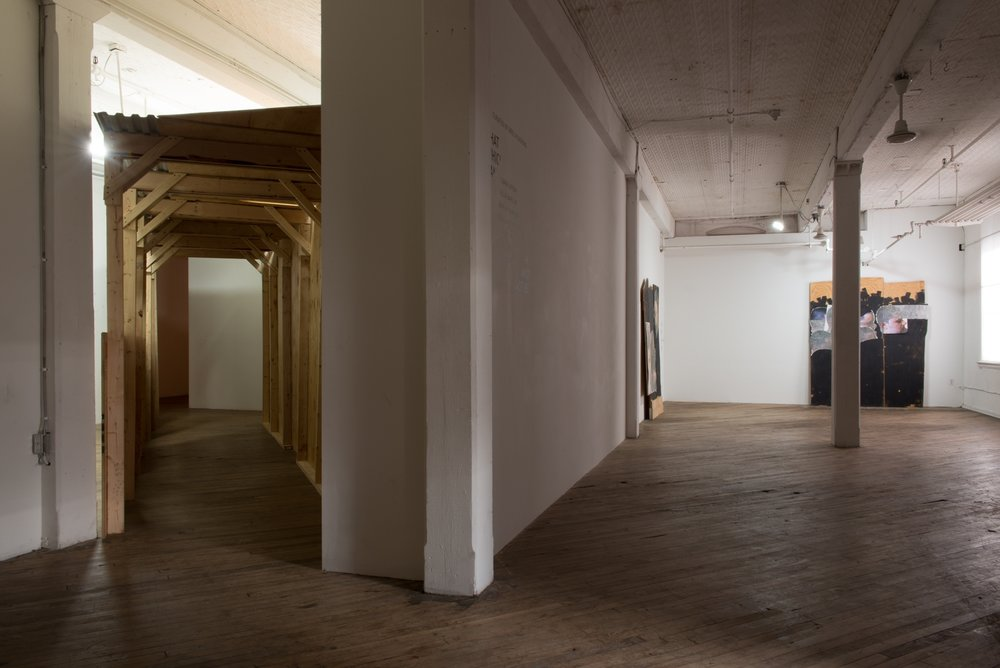
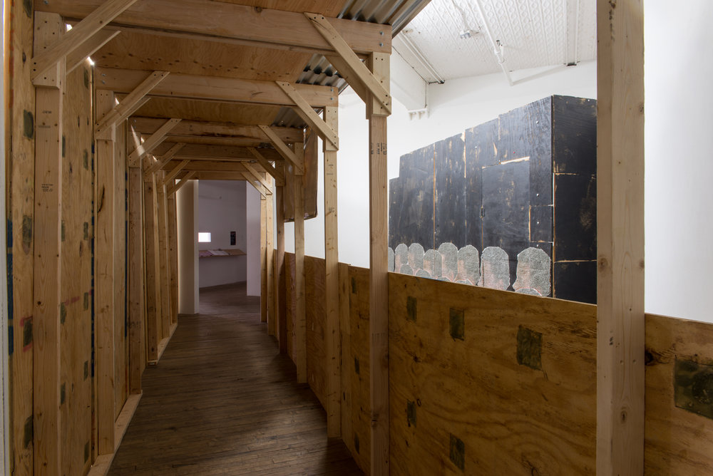

In the spring of 2016, visitors to the San Francisco Museum of Modern Art [maintained a safe distance](https://www.nytimes.com/2016/05/31/arts/sfmoma-glasses-prank.html) from a pair of reading glasses placed jokingly on the gallery floor because disciplinary muscle memory erects its own stanchions. The joke was hollow, though: its punchline relied upon the figure of the artist (contemporary; of the readymade variety) and the structure of the museum, but laughed longest at the spectators who unwittingly completed the mise-en-scene.

Almost three thousand miles east of SFMOMA is [Vox Populi Gallery](http://voxpopuligallery.org/exhibitions/that-which-cannot-not-be/), where an installation called *Shotgun Inversion* by [Wilmer Wilson IV](http://www.r-e-c-u-r-r-i-n-g.info/) was housed in fall 2016. *Shotgun Inversion*—a large wooden structure, almost scaffolding but more like a pedestrian walkway built to redirect urban foot traffic during construction—is perhaps the foil to the SFMOMA glasses prank. The walkway, made of untreated slabs of wood, bisects the square gallery diagonally, creating a total wall on one side of the corridor and a viewing mechanism on the other, through which can be seen _Modern Hair Designs II_, a sculpture set back several feet from the pedestrian structure.

Each time I visited the space to see _Shotgun Inversion_, fellow onlookers seemed more or less unaware of or unconcerned by its status as a sculptural object. People leaned up against the wall or brushed their fingers against it as they passed, chainlink fence-style. A friend and I hung our arms over the waist-high partition on one side like it was a carnival booth. One visitor wondered aloud what she'd do if she dropped her phone on the other side of the structure. The sense was that *Shotgun Inversion* was not the main event, but the system of containment for Wilson's glittering sculptural works in which he affixes ephemera from the street—advertisements for parties or barbershops—to sheets of wood by means of hundreds and hundreds of swirling staples.

Installation view of <i>That Which Cannot Not Be</i> at Vox. <i>Shotgun Inversion</i> is on the left & two of Wilson's stapled pieces can be seen on the right. Image courtesy the artist and CONNERSMITH. Photo: Julia Staples.

The construction-detour walkway—along with other pedestrian management devices, like the sidewalk, crosswalk, scaffold, fence, bus shelter, or channelizer cone—is both immediately understood as a bodily directive and immediately forgotten as a matter of course. It requires very little linguistic signage because we already know how to propel our bodies through it. Its physical shape shifts to suit the needs of the city, but its post-no-bills ethos aims to make itself as standardized, unremarkable, and universally understood as possible. In moving such a structure indoors, Wilson recasts the pedestrian underpass—in cinema and elsewhere, a frequent site of crime, paranoia, claustrophobia—as a space conducive to slow and thoughtful looking, to sociality. Its indoor existence, now borne of something other than necessity, engenders something other than the sense of being herded. Walking in the city, my pace quickens as I'm directed into this construction that invariably makes me feel more vulnerable than I did on the unenclosed sidewalk. How strange to now pass through this structure on feet moving at museum pace.

It's not the first time Vox Populi has hosted architectural interventions in its gallery space; in November 2015, Stephanie Bursese's installation [_Changing the Tense_](http://voxpopuligallery.org/exhibitions/stephanie-bursese-changing-the-tense/) featured a partial wall that punctuated the gallery with a glossy, black, unopenable door. This wall intruded. It was unavoidable, both physically and interpretively. *Shotgun Inversion* neither intrudes nor makes its presence unavoidably felt, yet still manages to massively orchestrate the flow of bodily traffic through the exhibition.

*Shotgun Inversion* has rare qualities of gentle coercion and absolutely none of them are unfamiliar. We encounter them daily. Bruce Nauman's neon-lit corridors—antagonistic to our easy gallery-wandering sensibilities—have what Fionn Meade has called an "aesthetic of encounter." They exercise their own coercion in that their very existence as extremely narrow hallways prompts us to transpose our own bodies onto them, to imagine the ways in which our bodies can or cannot fit through them. They also don't exist outside the gallery, and neither does Stephanie Bursese's impenetrable wall. They have an aesthetic of encounter in part because they aren't included in our structural pedestrian vocabulary. We haven't encountered them countless times on the street; we haven't encountered them at all.

Courtesy the artist and CONNERSMITH. Photo: Julia Staples.

What's rare, [according to McKenzie Wark](https://www.versobooks.com/books/1869-the-beach-beneath-the-street), "is to turn a critical theory of delinquency into a delinquent critique." Contemporary art is fond of denaturalizing the everyday by rendering unfamiliar our most familiar objects, behaviors, and processes. What's rare is to further naturalize the already naturalized, as Wilmer Wilson IV has done in constructing an indoor sidewalk with no raison d'être, no aesthetic of encounter, no real aesthetic at all: a detour for its own sake. I do love disobedience that looks just like compliance.

A dream I occasionally have: I'm walking down the corridor of an endless public restroom, each one of its stalls unusable—shit-covered or broken-handled or occupied—so my body carries me straight ahead while I continue to look to my left and my right for any functional infrastructure. When I reach a promising stall, I look in its direction and move my body toward it, whereupon the toilet begins spraying water straight in my face. I promptly wake up. But a dream, like art, is interesting to recall insofar as the listener has also seen it herself.

---

**Of note:**

Wilmer Wilson IV, [_Five Points on Straight Lines_](http://icaphila.org/notes/8282/five-points-on-straight-lines), Institute of Contemporary Art. ("One of the hardest things to do is to travel in a straight line.")

Angie Schmitt, ["The Least Crossable Streets in America,"](http://gizmodo.com/the-least-crossable-streets-in-america-1578935187) Gizmodo. In writing this piece I fell down a deep rabbit hole of researching urban infrastructure & street/sidewalk design. It was also during a period of time when I was walking to and from work every day. I work on a university campus, so beyond the usual pedestrian impediments there is also constant construction. This list of poorly designed streets underscored the moments at which bad design is so bad that it reaches the level of local infamy.

Fionn Meade gave a really good talk called "From Event to Refraction" at a symposium called "Museum as Score" at the Philadelphia Museum of Art on September 10, 2016. It doesn't look like there's any documentation of it online, unfortunately, but [here](https://files.acrobat.com/a/preview/f6477219-8931-48e0-8699-4636a878cd9f) is a PDF of the symposium program. Meade spoke beautifully about Bruce Nauman and got me thinking about the possible connections between Wilson's and Nauman's work. There's [a Nauman exhibition](http://www.philamuseum.org/exhibitions/848.html) up now at the PMA through April 16, 2017.
