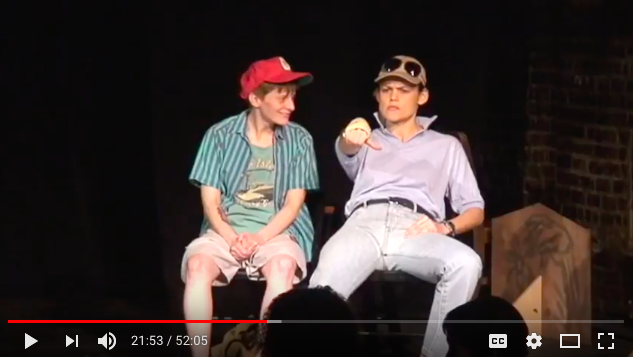
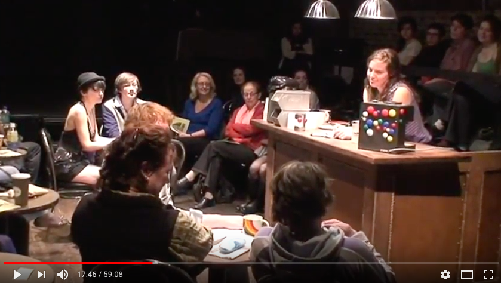

I've been thinking a lot about charisma lately.

Most directly, Wilmer Wilson IV gave a brilliant talk at the University of the Arts called "Uncharisma in Performance" last week, which was both an overview of his body of work as well as a call to action against the hegemonic forces of charisma in performance work and in the archives. Charismatic figures (we tend to think of this as a positive attribute, but Wilson used the infamously racist and homophobic former Philadelphia mayor Frank Rizzo as an example) tend to dominate archival records, literally and figuratively silencing marginalized figures, who are cast to the outskirts of recorded history or deleted altogether.

In his 1973 essay "What is Charisma?," Martin E. Spencer distinguishes between "supernatural" and "secular" forms of charisma—the former being "only possible" in "a world populated by devils, angels, spirits, demons, and gods," and the latter being the dominant variety we encounter every day, most distinctly in the form of celebrities, politicians, professors, and the like. The undercurrent through these different forms, the defined essence of charisma, is "an attitude of awe."

Having spent the majority of my life thus far in the position of being a student, the type of charisma I've experienced most directly and regularly has been that of the professor, that figure who, according to Spencer, "may generate a charisma in an epoch of generation gaps by adopting the symbols of grooming and dress of his students and by displaying a style of 'radical chic' that corresponds to the anti-authoritarian ideals of his students." I have tended toward teachers and professors who put forth very strong—often polarizing—points of view and pedagogical methods. I've found it generative for my own development as a thinker and person to use this polarizing figure to better understand my own opinions and investments, whether in accordance or in opposition to the figure in question.

Charisma often comes part and parcel with this polarizing modus operandi, and the difficulty with charisma is, of course, precisely the definition of its effect as given by Spencer—the attitude of awe. Awe interferes with objectivity and criticality, oftentimes at the very moment when critique is most needed. In this regard, I've been revisiting the figure of [Kenneth Goldsmith](http://twitter.com/kg_ubu) lately, a college professor of mine and a person I at one time regarded as a mentor. Goldsmith is one of those figures that Spencer would classify as a Charismatic Innovator, someone who "does not strike the canvas of history with the force of his individuality, but deftly reaches into the historical situation to create a value order that is ripe for the time." Kenny's entire pedagogical foundation is built on unoriginality, plagiarism, and appropriation. The extent of his charismatic affects, from his voice to his clothing to his style of teaching, are too far-reaching to delve into fully here, but suffice it to say that the aura he created was often one of awe, which seeped into the classroom even if I did not feel my ability to remain critical was being constantly compromised.

In light of Wilson's talk at UArts as well as my individual readings on charisma and musings on Kenny's place in my academic and personal life, I've been feeling fairly negative about charisma lately, and with good reason. As Wilson and Spencer both argue in different but dovetailing ways, charisma has the tendency not only to cloud an audience's judgment, but also to instantiate cultish behavior, reinscribe oppressive notions of conventional beauty and body standards, mimic or actually engender tyranny, and marginalize or re-marginalize those figures who are unwilling or unable to perform in such a way that would produce feelings of awe, affection, love, or desire in others. However, given that charisma is so engrained in the fabric of our daily experiences, I'm also interested in what can be recouped from it, or where it might actually serve the interests of those marginalized or ephemeral individuals normally cast outside of its glow.

It was good timing, then, that I attended a performance of ["Room for Cream"](http://www.newmuseum.org/calendar/view/1247/the-dyke-division-of-the-two-headed-calf-room-for-cream) by The Dyke Division of the Two-Headed Calf at the New Museum this past weekend. The performance was staged as part of the museum's current exhibition [_Trigger: Gender as a Tool and a Weapon_](http://www.newmuseum.org/exhibitions/view/trigger-gender-as-a-tool-and-as-a-weapon), and took place in the institution's white-walled and glass-partitioned main lobby—not a space specifically designed for theater whatsoever. It served as a revival or reunion of sorts, given that it ran serially from 2008 to 2010 at a different space in New York; it was reconfigured on the occasion of this exhibition.

"Room for Cream," briefly, uses the form of the soap opera to stage interpersonal dramas in the fictional setting of Sappho, Massachusetts, "a lesbian enclave and life experiment that is paradoxically both separatist and inclusive by nature of its world-building aspirations." Its cast ranges widely in just about every possible axis of identity, and in its New Museum iteration, made use of the museum's cafe and was staged almost like a dinner party. The writers and directors did not attempt to conceal very much at all of the production's mechanisms, from its "offstage voices" that remained in clear sight, to character entrances that were not cordoned off with a curtain or wall. There seemed to be nothing outside the diegesis of "Room for Cream," even the makeup of audience members, the reflection of a blinking crosswalk sign against a glass wall, or absurd hissing puffs of fog or smoke coming from the ceiling above the museum's bookstore, which perhaps was a part of the _Trigger_ exhibition. Like a queer vacuum, "Room for Cream" folded these elements into the Sappho-world in its messy and gleeful way.

Still from "Room for Cream," Season 2, Episode 5 ("Baby Mamas"). Not too much fussing over props.

As we know, the power imbalances between audience and performer cannot be simply ignored or done away with by literally leveling the space between these groups, but sometimes it helps. Most of the audience members at this production of "Room for Cream" were on the same level as the performers, seated in a single row of chairs and stools on either side of the play's proceedings. However, there was still a clear distinction between performers and non-performers. Cast members did not physically or verbally interact with audience members, nor did they ignore them. There were also power dynamics that seemed apparent among the cast members themselves in terms of acting "ability" or "skill," and which is confirmed in  [a 2008 review](http://twoheadedcalf.org/press/cream/rail.html) of "Room for Cream" in *The Brooklyn Rail.*  "The biggest challenge in directing Cream is balance," explains \[director Brooke\] O'Harra. "Every element demands a balance of what we protect and what we let just fly by the seat of its pants. For example, we work with a combination of professional actors and amateurs, who bring something strange and unique into the room. I have to decide how to keep them in the world of the actors and yet let them disrupt our world and patterns of live performance."

As Spencer writes in "What is Charisma?," one element of charisma is mastery or expertise. Whether or not that expertise is in fact "real" matters less than the untarnished façade of that mastery. In bringing unprofessional actors to the stage and in allowing for or even encouraging mistakes and messiness, "Room for Cream" works to tarnish its own veneer as a site of theatrical expertise. (This veneer, I think, is established by the mere presence of a performance within an institution; audiences enter with the expectation of a certain level of mastery.) Within the text of the script, "Room for Cream" also refers constantly to itself and its setting as an illusion. In the New Museum production, the play reaches its climax when Sappho's two spiritual gurus break down in hysterics and/or glee as they realize that the protective forcefield around Sappho has torn apart and outside is seeping in, inside seeping out. Likewise, many of the actors in the shifting cast have themselves changed over the course of almost a decade: not only have they aged, but many have undergone transitions in gender and/or presentation. Charisma relies on the unbroken production of a stable image, and the knowing disorder of "Room for Cream" resists this charismatic pull.

Still from "Room for Cream," Season 2, Episode 4 ("Of Age"). From this vantage point it's not entirely clear where the cast and the audience divide.

Still, "Room for Cream," as a stage production rife with humor and lovable characters, cannot altogether escape its own charm. A 2010 _New York_ Magazine [writeup](http://nymag.com/bestofny/fun/2010/lesbian-meet-up/) on the series, in fact, explicitly frames it in these terms: "_The L Word_ certainly has its fans, but they're not nearly as devoted as the followers of La MaMa Experimental Theatre's lesbian drama _Room for Cream_...The cast have become cult stars of a sort—after each show, the audience loiters on the sidewalk, waiting to follow the actors to any number of after-parties at nearby spots like Heathers or Fish Bar." I think much of the magnetism of "Room for Cream" and its cast comes from its creation of a social space with the representational specificities of gender and sexuality that are so difficult for lesbians to come by. Its seriality from 2008 to 2010 was an occasion for audiences to continually renter a world that seemed like it was in some way made for them.

By the same turn, the charisma of "Room for Cream" is tinged with the queer feeling that you might already be part of its production. It may present a utopia of sorts, one that its own instability does little to blemish, but it is the rare kind of charm that turns outward from itself into the world of the "real." By rupturing so clearly into the social dynamics it describes, "Room for Cream" asks to be seen not only as a production—with its camp, humor, absurdity, staging—but as a provocation, an inquiry into the fashioning and maintenance of queer sociality and how it might be differently imagined. And its very cast members are the same people who might be doing the reimagining alongside you once the applause is over.

---

**Of Note:**

The first three seasons of "Room for Cream" are documented [here](https://www.youtube.com/channel/UC93-mUxEOaxnwCqOvwuUZPw/videos).

In his lecture, Wilson also underscored the importance of describing charisma in ways that diverged from the specificity of the word "charisma," and referred to the book [_It_  by Joseph Roach](https://www.press.umich.edu/171014/it) (i.e. "It girl").

Ben Ratliff, ["Pop Veterans Still Pumping Anti-Charisma,"](http://www.nytimes.com/2008/06/16/arts/music/16stee.html) New York Times. This was one of the top Google results for "anti-charisma in performance"—I was trying to find a webpage for Wilmer Wilson's lecture—and a close reading of the author's review of a Steely Dan show gives a decent negatively-produced definition of charisma. Anti-charisma, according to Ratliff and through the Steely Dan performance, is apparently obliqueness, bad humor, the wearing of sunglasses, "the mystery of how they divide labor, \[and\] their comfort with yielding power to others."
