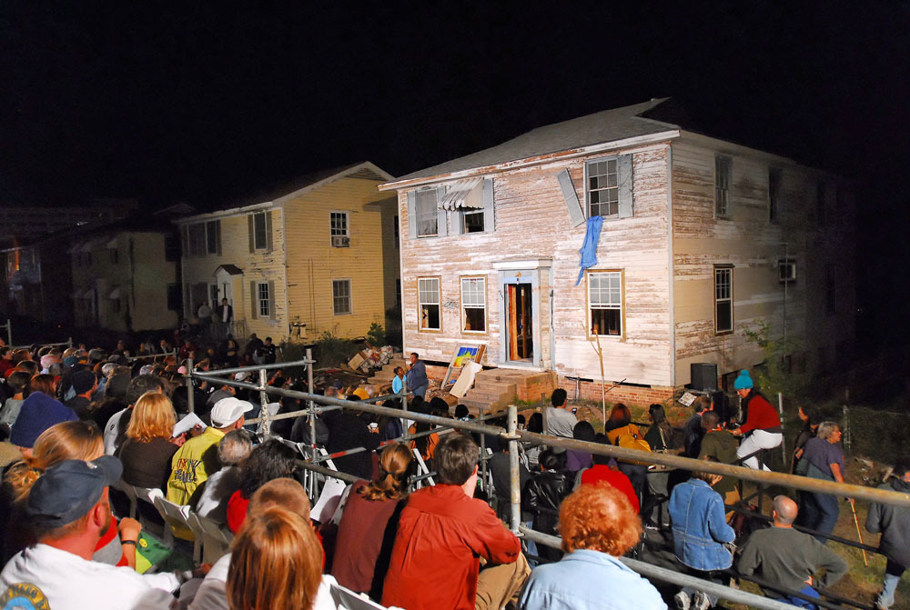

"Environmental disaster is akin to political revolution."

In a [recent lecture](https://www.phf.upenn.edu/events/art-disaster-utopia) at the University of Pennsylvania, writer Rebecca Solnit put forth an abbreviated theory of disaster, assembling a rhetorical toolkit for activist work and artistic production in an age of the continual crisis. Unsurprisingly, Solnit traces her thinking about contemporary disaster and its after-effects to the collapse of the Twin Towers in 2001. She then draws this thread through to the devastating effects of Hurricane Katrina on the city of New Orleans; then, finally, to the most recent of major North American disasters, the election of Donald Trump in November 2016.

Panic, according to Solnit, is "astonishingly rare." We've been sold a narrative—via the machinations of Hollywood, television, and literature—about who we are, culturally, in times of crisis. It involves selfishness, individualism, panic, hysteria, greed. This is not the full story, says Solnit; in fact, it's not the story at all. Her work on the ground, her work of witnessing, and the oral histories she's collected tell a very different tale of our collective ethos and behavior in the wake of disaster. Moments of crisis are actually moments of community- and coalition-building, moments of neighborly assistance and "public love," moments in which the usual constraints of the social order fall to the wayside and what's revealed are our best and most altruistic selves.

In her lecture, Solnit explained this phenomenon in jumbled metaphors of light and dark, asleep and awake. The disaster is the blackout in which, essentially, the strains of capitalism are temporarily halted. In this often-literal darkness, we may be fumbling around in material rubble but are nonetheless able to access an unfiltered and community-oriented version of ourselves. Disaster "jolts us awake," out of the mundanity and drudgery of everyday life in which we're forced to act greedily and selfishly in order to survive. While it may seem like the disaster itself is the main problem to be solved, the even bigger issue is "staying awake" (woke?) when the disaster lapses, i.e., replicating the quasi-utopian results of disaster (the building and restoring of relationships, communities, and coalitions) without the presence of crisis itself.

The 2017 <i>New Proverbs</i> protest signs of Paul Chan & Badlands Unlimited in action.

Throughout Solnit's lecture, it occurred to me that the themes and case studies from which she draws bear a striking resemblance to the practice of another contemporary artist: Paul Chan. The incredible resource that is Paul Chan's [_Selected Writings 2000-2014_](https://badlandsunlimited.com/books/selected-writings-2000-2014) begins with "The Rewriting of the Disaster," a speech given at Scripps College in November of 2001. "Let me begin with a confession," the first line reads. "I do not feel up to the task of speaking to you today after what has happened in New York, where I live. It is as if everything has changed. Even time is different: it feels both terribly intimate and infinitely distant. It is hard to describe. It is also a unique quality of the disaster, which I will return to later."

Chan's recalling of 9/11—a wound, at the time, so fresh and traumatic that it's better left unnamed—is also Solnit's first theoretical milestone. Six years after he delivered that speech, Chan staged *Waiting for Godot in New Orleans,*  perhaps his most well-known work, weaponizing Samuel Beckett's play against the massive failures of FEMA in a ghostly city still ravaged in 2007 by Hurricane Katrina. Nine years after that, Chan released a series of posters, *New Proverbs* and _New No's_,  through his publishing imprint [Badlands Unlimited](https://badlandsunlimited.com/). Riffing on the style of the Westboro Baptist Church's hateful protest signs, Chan's playfully bite back at the current administration ("FAGS HATE TRUMP") and stake out a set of demands ("No to bounds by genders / No to clickbait as culture / No to news as truths / No to art as untruths"). 9/11, Katrina, Trump—just like Solnit.

![Paul Chan, Pentasophia (or Le bonheur de vivre dans la catastrophe du monde occidental [The happiness of living in the disaster of the western world]), 2016. Nylon, metal, concrete, shoes, fans, various papers. @ Greene Naftali Gallery, NY…](../../../static/assets/pentasophia.jpeg)

Paul Chan, <i>Pentasophia (or Le bonheur de vivre dans la catastrophe du monde occidental</i> \[The happiness of living in the disaster of the western world\]<i>),</i> 2016\. Nylon, metal, concrete, shoes, fans, various papers. @ Greene Naftali Gallery, NYC.

Studied side-by-side, the work of Rebecca Solnit and Paul Chan lays a groundwork or a blueprint for what it means to be an activist-artist (or is it artist-activist?). They share many targets, case studies, obsessive themes, and tactics. Both immerse themselves on the ground in activist work rather than simply theorizing about it. Both seek the immediate post-disaster situation both as a theoretical touchpoint and in order to lend their various skills to the project of community in the wake of collapse.

But what does it mean to factor violence into one's assessment of disaster only sparingly or selectively? What does it mean to omit a deconstruction of violence altogether? In her lecture, Solnit made the direct comparison between political revolution and environmental disaster, arguing that both enable a sort of social collapse, out of which can spring forth a reinvigorated sense of community, political action, even love.

Yet Solnit also put forth the model of nonviolent direct action as the only tool for implementing political change—a model that's been "proven" to work more effectively than the leveraging of violence. Solnit is able to see the redemptive qualities of the violence of an environmental force majeure, but not that of violent political action. She speaks of revolution unspecifically and uncritically, as if revolution is possible without violent action, and as if revolution always happens in service of her progressive politics.

Much as Solnit's nonviolent direct action in cases like the Western Shoshone Defense Project has been important, she refuses to acknowledge that the progress she credits fully to nonviolent civil disobedience has been propelled forward most dramatically by those willing to put their lives on the line in violent conflict for the cause. These are the marginalized bodies—people of color, the poor and disenfranchised, queers, women, and the disabled—on whose backs political revolution is fully realized.

Perhaps there's a generational shift at play between Rebecca Solnit and Paul Chan that can partially explain their divergence in artist-activist tactics. Chan—a writer, but primarily a visual artist—understands the violence of visual representation, and, I think, harnesses that power responsibly. From repurposing the aesthetics of the Westboro Baptist Church to publishing a book of Saddam Hussein's speeches on democracy, Chan does not shy away from the realm of violence. Perhaps what attracts me to Chan's model of artist-activism over Solnit's is his integration of art and activism simultaneously, rather than one after the other. This simultaneity isn't always possible, but it feels like the difference between a lecture like Solnit's and a project like *Waiting for Godot in New Orleans,*  in which Chan cast native New Orleanians in a free performance in the middle of a desolate intersection of a city with a rich history of street performance. As Chan writes, "In New Orleans in 2007, Godot is legion and it is not difficult to recognize the city through the play. Here, the burden of the new is to realize the play through the city."

Opening night of <i>Waiting for Godot in New Orleans</i> in the Gentilly neighborhood.

And, of course, I'm biased—I do believe that in order to survive and progress, we need a more evolved ethos regarding violence and lawlessness than the one Solnit posits. In "A Lawless Proposition," another essay in his _Selected Writings,_  Chan writes, "Law represents a border that separates what the sovereign past justifies and what the frontiers of a more just future might hold. This is why political movements that embody new and substantive calls for more justice, liberty and equality must act without fear of being unlawful. Otherwise they would not remain true to what first inspired them to act: the promise of a time to come, where law has no jurisdiction."

---

**Of note:**

Paul Schmelzer, "[What Can Saddam Teach Us About Democracy? Or, Why Did Paul Chan Publish a Book About a Dictator's Speeches?](http://www.walkerart.org/magazine/2012/paul-chan-saddam-hussein-democracy)" The Walker Magazine, 2012, an interview with Paul Chan. Chan speaks to the skills he learned in art school (Photoshop, visual literacy) and the pragmatic role they played on the ground in Baghdad. When asked why he published a book of Saddam Hussein's speeches, Chan replied, "Well, I did it because it was profoundly confusing and interesting. I think of what Bertolt Brecht said: 'We shouldn't start with the good old things, we should start with the bad new things.'"

Paul Chan's _Pillowsophia_ [is on view at PAFA](https://www.pafa.org/exhibitions/paul-chan-pillowsophia-0) through May 28, 2017.

Erin Sheehy, ["Notes on Bayou La Batre,"](https://nplusonemag.com/online-only/online-only/notes-on-bayou-la-batre/) N+1. "'Y'all here for for the spill?' waitresses asked us as they refilled our pint glasses of sweet tea." In the wake of the 2010 Deepwater Horizon oil spill, Sheehy highlights another, less utopian after-effect of disaster: the commodification of its consequences and the "unnerving bustle" of the influx of journalists and onlookers to the site of the crisis.
