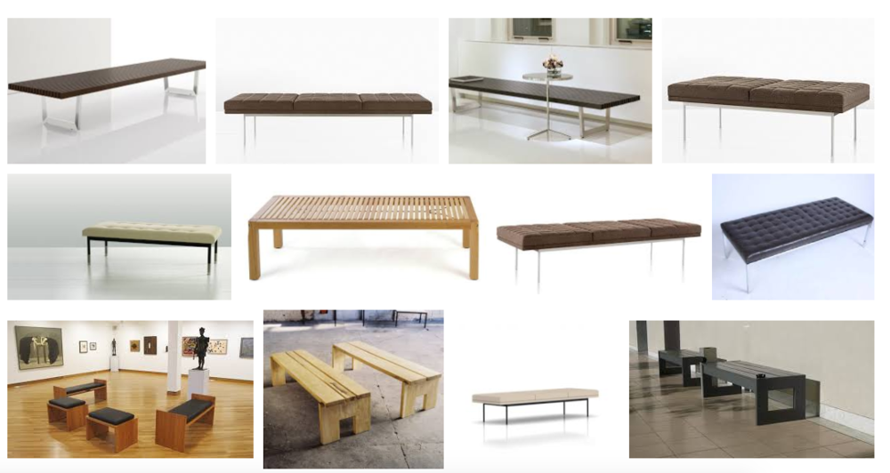

I hardly remember any of the work I saw at the opening of _Barbara Kasten: Stages_ at the Institute of Contemporary Art back in 2015. This, in and of itself, seems unremarkable; I go to many openings and feel I see little or retain nothing. But this time it was specific: I was deep in the throes of a debilitating crush, and what I remember clearly is feeling flushed, hot-faced and anxious, waiting for this person to arrive or for the oncoming wave of disappointment if they didn't. I remember looking for an inconspicuous place to sit and gather my bearings. After circling the full perimeter of the galleries once and finding the bar area too crowded and the gallery benches too sterile and exposed, I went outside into the cold winter air and sat on the curb, immensely grateful to be out of the museum and back in the world.

I found myself revisiting this now distant-feeling scene while reading "An Aesthetic Headache: Notes from the Museum Bench" (full text available online [here](http://joelsandersarchitect.com/an-aesthetic-headache-notes-from-the-museum-bench-with-diana-fuss/)), an essay by Diana Fuss and Joel Sanders featured in the CCS Bard compilation _Interiors._   In it, Fuss and Sanders chronicle the history of the museum bench, that cast-off and generally unconsidered but ubiquitous piece of furniture found in nearly every museum and gallery. The authors charge modern and contemporary art museums with being "largely indifferent, if not overtly hostile, to the demands and desires of the spectator's body. Perpetuating a Western bias that dates back to the Renaissance, art critics view the spectatorial body as hardly a body at all but more a disembodied eye, associated with mind, imagination, and vision—rarely an actual body...And yet there is no spectator without a body, a body that gets overheated, tired, bored, or distracted."

Google's first twelve image results for "museum benches"...hmm.

Even those institutions that perform auto-critique or feature work that calls attention to the presence of the viewer's body in physical space (examples of which include Bruce Nauman and Wilmer Wilson IV, as I've written about [here](https://www.mosquit.ooo/home/2017/channelizer)) rarely question what could be done to better and more comfortably facilitate the movement of bodies throughout the actual gallery spaces. The institutional modus operandi is one of meeting [basic accessibility guidelines](https://www.ada.gov/business/museum_access.htm) and providing one bench per gallery (if that), much like a landlord ensuring access to basic ventilation and a fire extinguisher out of pure legal duty. Deviances in the norm of museum bench style and design seem to arise only out of exhibitions centered on themes of "the domestic." Those deviances make me wonder what could happen if the museum bench were treated less as a given and more as a jumping-off point for something else. As Fuss and Sanders write, "We believe that it is high time, perhaps even past time, to treat the museum bench as not an aesthetic headache but a creative opportunity."

I return to the ICA now both because it has brought the museum bench into question in its current season of exhibitions and because, as a full-time employee of the museum, I spend more time in its building than I do almost anywhere else. I have often half-jokingly bemoaned with fellow coworkers the lack of a room in which to nap at ICA, but the more I consider "An Aesthetic Headache," the more the sentiment rings true. At present, ICA has few places in which to congregate and socialize comfortably: its communal seating includes picnic tables on the outdoor terrace (weather permitting), round cushions on wheels that resemble large buttons (backless, awkward), IKEA stools (ditto) and, of course, gallery benches. As both a gallery visitor and a staff member, I am acutely aware of the discomfort of choosing any of these options for a prolonged period of time.

Selfishly, this is part of the reason I was so excited to see _[Ginny Casey & Jessi Reaves](http://icaphila.org/exhibitions/8484/ginny-casey-jessi-reaves)_ materialize at the museum this spring. The show features the work of Ginny Casey, a painter, and Jessi Reaves, a sculptor, the pairing of which is meant to "unravel the differences between modes of display"—the home, the exhibition, the department store—to underscore the ways in which art is "embedded within, rather than removed from, the fabric of the world," according to Charlotte Ickes, the exhibition's curator. Simply put, the furniture-sculptures of Jessi Reaves can be interacted with—namely, sat on. Reaves's functional furniture ranges from reupholstered plastic chairs to a leather hammock-like sling to a lush ottoman that wraps around the wall of a gallery divider. There are no benches in this exhibition. Enter the renewed possibility of napping in the museum.

Jessi Reaves's <i>Ottoman with Parked Chair & Ottoman</i>, 2017, the main bench-substitute featured in <i>Ginny Casey & Jessi Reaves</i>.

Really, there is something about the exhibition that conjures the realm of sleep and the possibility of several different levels of consciousness, human and otherwise. In [one accompanying text](http://icaphila.org/exhibitions/8484/ginny-casey-jessi-reaves) to the exhibition, Ickes positions *Ginny Casey & Jessi Reaves* within several different binaries—"interior and exterior, surface and structure, dependency and autonomy, inanimate and animate"—which Casey and Reaves's work both sits within and complicates.

Another binary might be "asleep and awake." In the exhibition's gallery notes, Ickes refers to the work on view as "ordinary repositories of dreams, nightmares, and fantasies." The most direct references to dreams and nightmares arrive in the form of Ginny Casey's paintings, still-life depictions of domestic spaces with a quasi-Surrealist bent. In processing Casey's oeuvre through the framework of Surrealism, it becomes clear that Casey is much more intimately invested in the potentialities of the/her body—including its joys and its horrors—than the capital-S Surrealists were. In André Breton's 1924 _[Surrealist Manifesto](https://tcf.ua.edu/Classes/Jbutler/T340/SurManifesto/ManifestoOfSurrealism.htm),_   Breton coins the term "pure psychic automatism," his working definition of Surrealism. The practices of "automatic" writing and drawing that followed from this theory were intended to open the artist's process to chance and accident through "random" bodily motions. Although this method did underscore the always-overlapping and intersecting nature of body and mind, it was a practice in service of revealing the machinations of the "pure psyche," unfettered by rationality; it ultimately sought to reveal the mind to itself ("the actual functioning of thought," wrote Breton), using the body as a mere tool.

Ginny Casey's Surrealism remains formally rooted in the body as a (literal) centerpiece, not an accessory. All the nightmarish qualities of her large, square canvases stem from human action—even if humans are never actually present—or are enacted upon the body (disembodied hands, fingers, feet, and ears punctuate her paintings). *The Potter's Ear*  (2015) features a bulbous, turquoise ceramic pot that opens broadly at the top but also features a small, chute-like opening at the bottom. During a walkthrough of *Ginny Casey & Jessi Reaves,*  Casey paused at this painting and mentioned she was pregnant while painting it, and was interested in depicting forms that offer "a way out as well as a way in." Casey is as invested in breaking as she is in building. Many of her paintings feature fractures and shards of broken objects, pointing to another route to Surrealism apart from the fantastical world-building of her predecessors.

Ginny Casey, <i>The Potter's Ear</i>,  2015. Oil on canvas, 55 x 55 inches.

Casey and Reaves seem to share the notion that one need not look much further than the human form and preexisting material to reference and summon the surreal; the world is nightmarish and unbelievable enough as to offer up a wide range of reference points for both of their work. Reaves sources the material for her sculptures from "found frames of chairs, chaises, and shelves" (Ickes), using techniques of draping, (re)upholstering, glueing, and fabricating to render them unrecognizable and uncanny. Reaves never loses sight of functionality, though: her sculptures that look like chairs are actually chairs, and what looks like a shelf or a coat rack does function as such. Against the ethos of both the museum bench and of modernist furniture design more generally, Reaves's sculptures assert themselves in favor of the body and the public: maybe, after all, people think, see, and engage most deeply with their surroundings when they are physically comfortable and at ease.

It is difficult to overstate that even at a time when museum programming is rapidly expanding in the arenas of visitor services and engagement—with initiatives like mindfulness and yoga, as well as more physically intense programs like The Met's ["Museum Workout,"](http://www.metmuseum.org/events/programs/met-live-arts/museum-workout) encouraging forms of bodily engagement beyond the gallery stroll—it is still a novelty to touch the art on view. Reaves's furniture-sculptures could just as easily function as view-only objects, but with the invitation to physically interact with her work comes a shift in focus and meaning.

In "An Aesthetic Headache," Fuss and Sanders write of the institutional anxiety around visitors sitting too long and indulging in their own bodily needs rather than attending exclusively to the work on display. In turn, like a coffee shop that furnishes its store with uncomfortable seating or does not provide free WiFi in order to discourage its patrons from idling too long at the same table, museums uphold the one-size-fits-all bench or do away with it altogether. "To counteract the pull of inattention," write Fuss and Sanders, "modern art museums like MoMA sought to manage spectatorship by reducing the number of seats within the gallery, entirely eliminating benches, or relegating seating to spaces like lobbies and hallways, which increasingly come to function as rest stops. The visitor's need for rest is not denied altogether but strategically relocated."

Jessi Reaves's <i>Mutant Butterfly Chair</i> (2017) installed in such a way that it becomes a station for viewing Ginny Casey's <i>Moody Blue Studio</i> (2017) and Reaves's <i>More Personal Headboard</i> (2017).

And yet, each time I've visited the gallery that houses *Ginny Casey & Jessi Reaves,*  either to look at the work or the fellow visitors or both, I've noticed that the moment the museum-goer realizes the furniture is there to be used for its everyday purpose is one of joy. There are the nappers, the texters, the squirmers—all of which are perfect in their own right. But nine times out of ten, the moment visitors sit down on Reaves's sculptures—now given permission to relax, to sleep, to acknowledge that there might be other bodily desires at play in the museum besides the viewing of art—this is the moment that people open the gallery guide, cross-check its illustrations with the work in front of them, and read the curator's essay, attending deeply and carefully to the work around them.

---

**Of note:**

Robert J. Weisberg, ["Mindfulness is a Terrible Thing for Museums to Waste,"](http://www.robertjweisberg.com/mindfulness-is-a-terrible-thing-for-museums-to-waste/) an interesting and sort of all-over-the-place piece of writing by an employee of The Met, which I arrived at while researching mindfulness programs at museums, but was drawn to the following excerpt: "Museums are full of contradictions—businesses that are mission-driven, centers of scholarly excellence that have to bring in a general audience, temples of perfectionism in curatorial and editorial which need to quickly pivot in visitor services and digital endeavors."

Elizabeth Guffey, ["Design For the Rest of Us: Where Are Design Museums' Benches?,"](http://designobserver.com/feature/design-for-the-rest-of-us-where-are-design-museums-benches/38117) a short essay on the notable lack of benches in design museums & design exhibitions by an author with cerebral palsy.

One of my favorite _Onion_ articles, ["Struggling Museum Now Allowing Patrons To Touch Paintings."](http://www.theonion.com/article/struggling-museum-now-allowing-patrons-to-touch-pa-2821)
