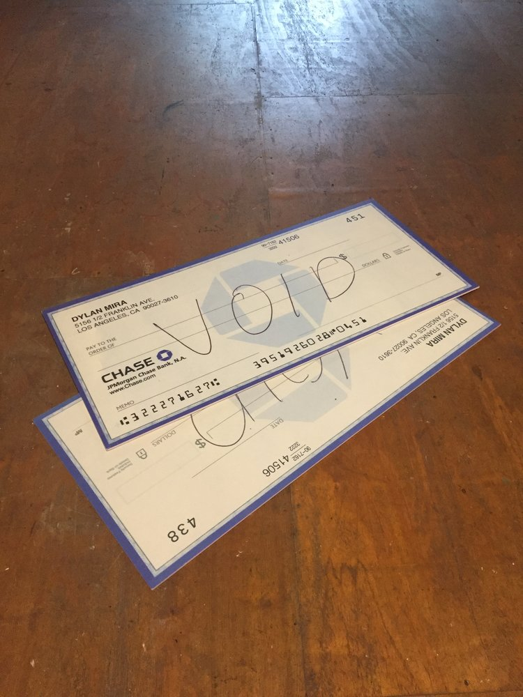
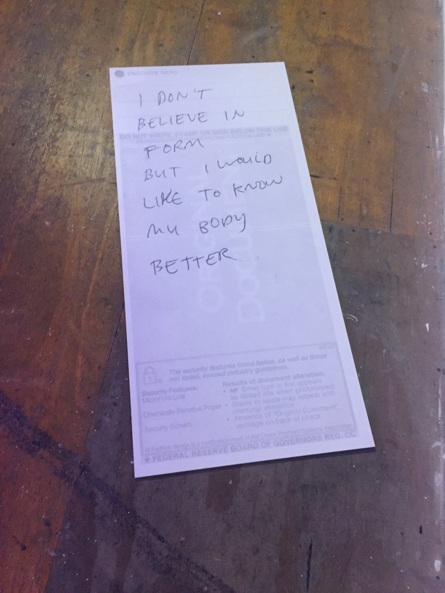
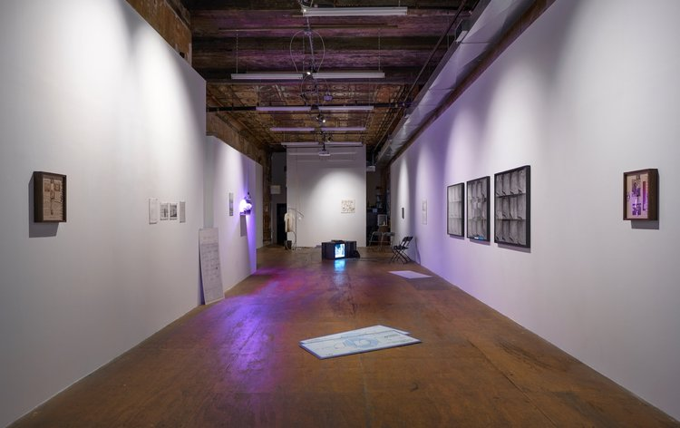

I haven’t written anything new here since September, partly a function of exhaustion, partly seasonal depression, partly my inability or unwillingness to see much new art. I wrapped up 2018 having seen a little over forty exhibitions—the bulk of which I saw when I was living in Philly and in the frenzied few months after I moved to New York. Last week marked one year in New York for me, and maybe I’m getting into a groove that’s neither total disengagement with the so-called art world nor a mania that drives me to say yes to everything.

Goldman Club, <i>Social Soil</i>, 2016-present. Rehabilitated soil from Trump Golf Links at Ferry Point (Bronx, NY), taken and intermittently nourished to grow latent weeds; nitrogen, phosphorous, potassium, activated carbon, gravel, and menstrual blood. Installation view at Participant Inc.

One exhibition I saw toward the end of the year really stuck with me, _A New Job to Unwork At_ at Participant Inc. on the Lower East Side. I saw it in September 2018, which comes as a surprise to me now; if I’d have guessed, I would have estimated I saw it earlier in the year, maybe April or May. As, perhaps, an aside, I find it difficult to keep track of time in a linear way, which is why I rely so heavily on lists. I keep lists of almost everything I do, from the exhibitions I see to the runs I take to when my periods start and stop to the submissions and applications I send out into the world. Looking at these lists side-by-side almost sets me apart from myself, as if I were looking at the personalized data of someone else. It offers a morbid cross-section of my life, my activities; it’s an archive. For a few years I’ve been keeping track of the books I read, and I’ve recently made this list public here in the hopes that, in lieu of any social media presence, it’ll provide some way to chat with people about what’s on the list or lend my own copies to friends if they’re interested.

Now this is feeling a bit like the [Rhizome net art exhibition](https://www.newmuseum.org/exhibitions/view/the-art-happens-here-net-art-s-archival-poetics) up at the New Museum—those slides that showed screenshots of Livejournal authors penning their final posts—which is embarrassing. What’s happened over the past year? I moved to New York, which has been moderately successful amid small and large failures, although I still don’t really know what the metrics are. I published some poetry for the first time in my adult life, chipped away slowly at new novels, both within and outside of the workshop group I’m in with Laura, Chelsea, Bridget, and Paige, began steadily ghostwriting erotica :~), editing for the Vera List Center for Art and Politics, and working with _Art Papers_ and _On Curating_ (no idea when those pieces will come out, though). My friends did so much cool stuff. [Cole](https://www.cole-lu.com/) and [Wilmer](https://wwiv.info/) showed their work all over; Laura published [_Whore Foods_](https://inpatientpress.bigcartel.com/product/la-warman-s-whore-foods) (and my roommate Sabrina designed the cover), [Dana](https://www.nytimes.com/2019/01/24/arts/design/new-museum-vote-to-unionize.html) and [Lily](https://www.jacobinmag.com/2019/01/new-museum-union-uaw-art-bargaining) unionized the New Museum, Sean and Adrianne started [a new band](https://cryinginpublic.bandcamp.com/releases), Gee curated [an exhibition](https://www.sculpture-center.org/exhibitions/11572/in-practice-other-objects) at SculptureCenter, [Liz and M](https://www.phillystewards.art/openings-and-events/2018/3/3/opening-liz-barr-m-slater-fit) exhibited their work right around the corner from where we all used to live in Philly, and on and on. Almost everyone I care for has had a difficult year, which makes their accomplishments all the more impressive.

Dylan Mira, <i>VOIDS</i>, 2015, 22 x 48 in. Digital inkjet print on PVC. Installation view at Participant Inc.

But: _A New Job to Unwork At_. I meant to begin talking about this. Something about it struck me in the right way at the right time. It was September, as I mentioned, and I’d just begun reading [_Debt: The First 5,000 Years_](https://www.mhpbooks.com/books/debt/) by David Graeber, a material history that manages not to get hemmed in or weighed down by (its) material. I began reading _Debt_ on my lunch break, a two-minute walk down Broadway from Zuccotti Park (Graeber, it should be noted, had an early role in Occupy), read the bulk of it during my only vacation of 2018, a week away from work in a cabin near the Canadian border, and finished it shortly after that trip in my apartment in Brooklyn. The reading of _Debt_ as such was made possible by my temporary liberation from my job (it’s 500+ pages, and, at least for this reader, required sustained, unbroken attention), and seeing _A New Job to Unwork At_ required stealing away from work an hour early in order to make it to Participant before it closed. The strictures imposed by wage labor make it difficult to see art or to enjoy the seeing of art once you’re in place—you miss the institution’s open hours _or_ you’re faced with dreadful weekend crowds _or_ you go to the opening, which gets you down about the whole enterprise of art to begin with and in which you don’t actually see the art. But I was able to see this exhibition in one of the in-between times apart from these categories, and I’m glad for it.

Graeber concludes _Debt_ in an open-ended fashion, contemplating the possibility of a future Jubilee, or widespread debt cancellation. In a contemporaneous (2012) essay called [“After the Jubilee,”](http://www.e-flux.com/wp-content/uploads/2013/05/2.-Graeber_afterJubilee.pdf) Graeber writes, “some kind of mass debt cancellation is on the way. Almost everyone is willing to admit this now. It’s the only way to resolve the sovereign debt crisis in Europe. It’s the only way to resolve the ongoing mortgage crisis in America. … why postpone it?” It’s now 2019 and, as I revisit this text, we feel no closer—in America, at least, but seemingly elsewhere as well—to mass debt cancellation. If anything, the current administration has doubled down on not only the financial but the _moral_ imperatives of paying off one’s debts, in every sphere from higher education to homeownership. However, if this eternal pushing-off of what Graeber (and many others) deem the inevitable has produced anything worthwhile, perhaps it’s an ongoing imaginary.

Dylan Mira, <i>VOIDS</i>, 2015, 22 x 48 in. Digital inkjet print on PVC. Installation view at Participant Inc.

In _A New Job_ at Participant, one was greeted by Dylan Mira’s flat sculptures—gigantic, voided Chase checks in the artist’s name—two prostrate on the gallery floor and one propped up against the wall. With [_VOIDS_](http://www.na-mira.com/mira/voids/), Mira offers up a deadpan dismissal of debt’s insistent hold on the present—rendering “present” essentially null, as it constantly atones for the past and worries toward the future. I remember reading a review of the exhibition that, in a short aside, shrugged off _VOIDS_ as “fall[ing] a little flat.” Their flatness—literal and otherwise—is exactly what I find so compelling about the checks, though. They’re flat, stupid, funny. They refuse to take up the seriousness, reverence, and shame with which we’re supposed to regard financial institutions, capital accumulation, and debt.

If Mira is here proposing a Jubilee a la Graeber, it’s operating not only at a different scale but to different ends. Understanding debts as essentially “promises of future productivity,” Graeber zooms out to a planetary scale, insisting that “the real burden of debt…[is] having to work ever harder, while at the same time, consuming more energy, eroding the earth’s ecosystems, and ultimately accelerating catastrophic climate change at just the moment we desperately need some way to reverse it.” (This need feels even more desperate now than it did in 2012, when he wrote this.) Mira’s _VOIDS_ feel, to me, individual in scale, even as they motion toward more universal gestures or sentiments. On the back of one of the voided-check sculptures, Mira has scrawled in all caps: “YOU SAID A PSYCHIC SAID / OH I SAID IT / WE WERE NEVER MAN / THE PART OF ME THAT KNOWS HOW LITTLE IT IS TO BE ONE.” In another iteration of _VOIDS_, the check’s back side reads “I DON’T BELIEVE IN FORM / BUT I WOULD LIKE TO KNOW MY BODY BETTER.” An irreverence toward money and its attending institutions allows Mira an inward turn—she uses her checkbook like scrap paper with which to contemplate her body, herself. She endorses these checks, but inscrutably.

<i>A New Job to Unwork At</i>, installation view. Photograph by Mark Waldhauser.

This feels as appropriate a place as any to say that I wish there were more money-related work made and shown in New York in particular. In _VOIDS_, Mira leaves her personal information—full name, address, and so forth—untouched and on view, and suddenly what was before a check now looks like an artist’s statement. I sometimes find myself perversely wishing that the competitive spirit that seeps into every corner of the New York-centric art world were, or were simply, about literal capital, instead of primarily cultural capital and other manifestations of prestige and recognition (often achieved through artistic practices based in concepts like anticapitalism, social justice, and prison abolition). It would feel less disingenuous.

Perhaps I felt most drawn to the work of Dylan Mira within _A New Job to Unwork At_—as well as that of Mierle Laderman Ukeles, whose _Sanman Speaks_, an hourlong video in which the artist speaks with New York City sanitation workers about the conditions of their labor, played on a monitor nearby—because she specifically and explicitly mines that which is not to be referenced out loud in art spaces, i.e. money. Even the recent uptake of _labor_ as a central organizing principle in [exhibitions](http://www.participantinc.org/seasons/season-17/a-new-job-to-unwork-at) and [volumes](https://mitpress.mit.edu/books/work) tends to shirk the various and uncomfortable questions regarding _money_—its genesis, its acquisition, its management and deployment. What may be easily dismissed as “flat” in Mira’s sculptural gestures feels, to me, an apt response to the incessant churn of bodies under capitalism, an exciting refusal, especially framed in contrast to the (equally exciting) grueling endurance performances of both Ukeles and Tehching Hsieh on nearby screens. If a Jubilee is imminent, and if we are the ones who will demand it, it seems more of this flatness—a frank, unsentimental attitude toward money and what it enables and disables—will be necessary.

---

**Of note:**

Jeffery Atik, “[The Cliff and the Jubilee: On David Graeber’s ‘Debt](https://lareviewofbooks.org/article/the-cliff-and-the-jubilee-on-david-graebers-debt/),’” _Los Angeles Review of Books_. “But there is something morally ambivalent about a Jubilee (no matter how much one might long for one),” writes Atik. “Time extends beyond the Jubilee—and the post-Jubilee accretion of new debt is accepted as a human inevitability; in Leviticus, the Jubilee happens every 49 or 50 years. A Jubilee is, at best, an accommodation with debt—it is not the destruction of debt.” I think Graeber actually addresses this criticism within the scope of Debt, theorizing debt as crucial connective tissue within social fabrics, not merely as a destructive force.

[Bernie Sanders is running for president again](https://www.cnbc.com/2019/02/19/bernie-sanders-is-running-for-president-in-2020--here-is-his-platform.html) and, thus, the never-ending primary nightmare will inevitably feature one of the most contentious pieces of his platform. The United States is so uncomfortable with debt cancellation that we refer to it as “forgiveness,” as if the structures that prop up class divisions operated solely at the level of the individual.

Here’s a 68-page report called “[The Macroeconomic Effects of Student Debt Cancellation](http://www.levyinstitute.org/pubs/rpr_2_6.pdf)” that counts among the effects of student debt cancellation “an increase in real GDP, a decrease in the average unemployment rate, and little to no inflationary pressure over the 10-year horizon of our simulations.” The Sanders Institute summarizes the paper here.
