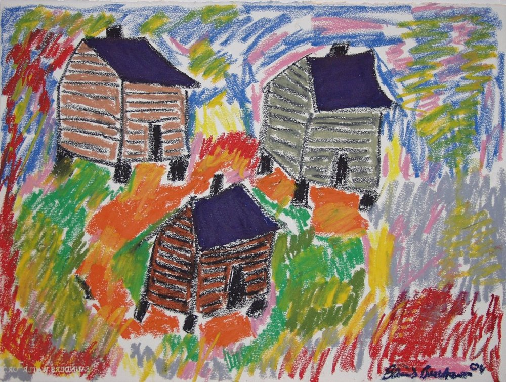
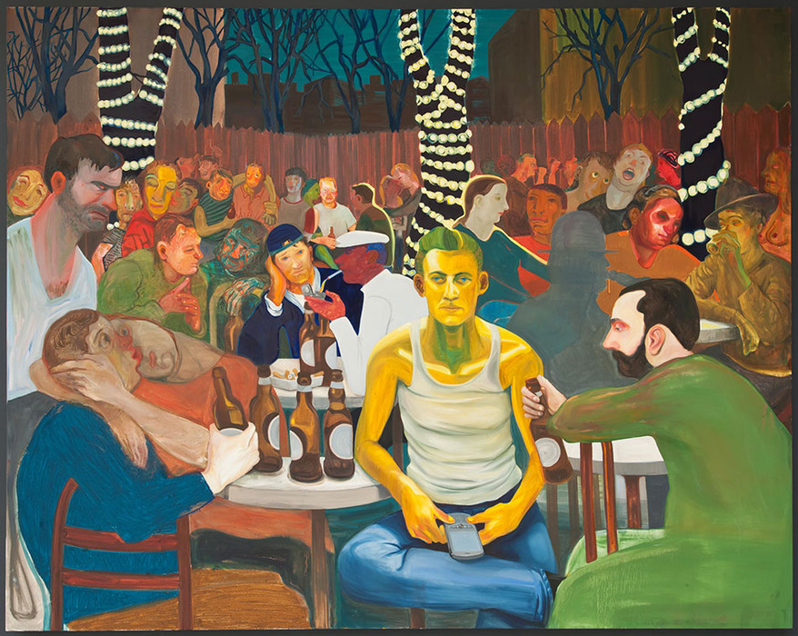
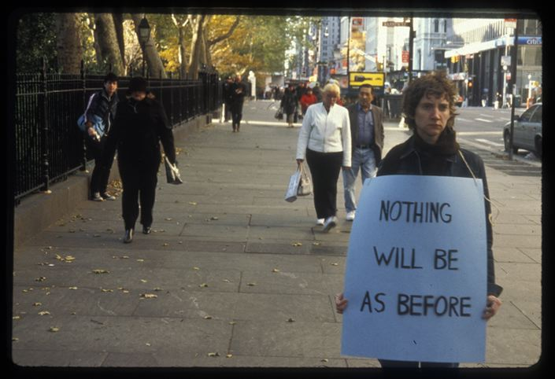
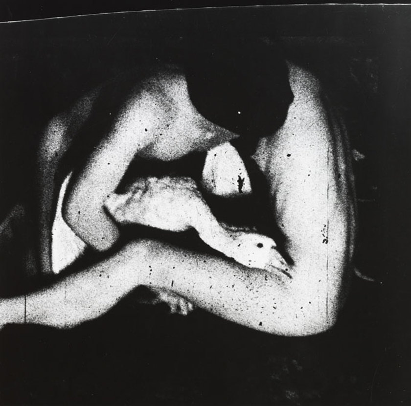
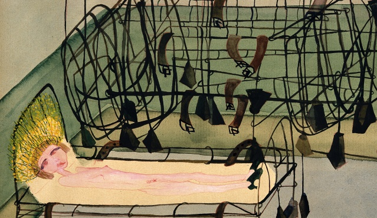

In her 2016 book _The Lonely City,_  Olivia Laing charts a course of urban loneliness—that unique form of longing in which you're surrounded by millions of other people but unable to make meaningful contact—through the biographies and bodies of work of four visual artists: Edward Hopper, Andy Warhol, David Wojnarowicz, and Henry Darger. These four twentieth-century artists, writers, and filmmakers all dwelled in either New York City or Chicago, and while their social lives ranged from iconically active and visible (Warhol) to that of complete and total reclusion (Darger), Laing contends that a primary driving force behind their impulse to create was a deep and irreconcilable loneliness.

Beverly Buchanan, <i>Three Shacks</i>, 2004. Oil pastel on paper.

Much as I enjoyed _The Lonely City_ as a breezy walkthrough of the works of four major artists from a vantage point not usually taken, I took issue with two major shortcomings in the way Laing executed this undertaking. The first is that aside from brief sections focusing on artists Zoe Leonard and Valerie Solanas (though, in the Solanas section, more on her mental illness and intense relationship to Warhol and less about the contents of her work itself), *The Lonely City* almost exclusively discusses men, eliding the rich historical text of women's isolation both in and out of urban landscapes.

Laing's previous book _The Trip to Echo Spring_ (2013) uses a similar strategy of discussing artists through a specific facet of their lives or personalities, this time profiling six major writers who were alcoholics. All six were men. Despite a brief discussion of feminism and her personal struggles with gender identity in _The Lonely City,_  Laing's formal writing structures still seem to uphold cliched and gendered notions of artistic production in a way that's tired at best and destructive at worst. (Isolation and substance abuse certainly don't need to be culturally glorified more than they already have been as expressions of artistic machismo and wellsprings of singular genius.)

Since women writers who drank to excess certainly aren't hard to come by in the canon—Dorothy Parker, Elizabeth Bishop, and Marguerite Duras among them—it must be that women didn't fit into the narrative of the story Laing was trying to tell. In [an article in the _Guardian_](https://www.theguardian.com/books/2014/jun/13/alcoholic-female-women-writers-marguerite-duras-jean-rhys)  published a year after the release of the _Echo Spring_, Laing writes almost begrudgingly, "If you write a book about alcohol and male writers, as I did, the one question you'll be asked more than any other is: what about the women?" She proceeds to write an entire article without answering the question of her own initial omission, instead extrapolating on several female writers—many of whom were the contemporaries of the men she profiled—devoid of a clear reason as to why they didn't fit the same bill or deserve a place within her story.

Nicole Eisenman, <i>Beer Garden with Ash</i>, 2009. Oil on canvas.

Throughout _The Lonely City,_  Laing also reveals herself as invested in a particular type of loneliness: that which is both borne of trauma and which helps produce masterworks. She often contends that the majority of adults experience loneliness regularly and that "like depression, like melancholy or restlessness, it is subject too to pathologization, to being considered a disease." Yet in bestowing this relatively mundane condition with the power to animate the oeuvres of the some of the most important twentieth-century artists and by choosing artists who suffered mental illnesses and abject childhoods, Laing herself manages to pathologize loneliness.

She digs deeply into archives and biographies for details on the tumultuous marriage of Edward Hopper and his wife, the abusive upbringing faced by David Wojnarowicz, the immigrant's isolation of Andy Warhol (and, later, a strong emphasis on his brush with death at the hands of Valerie Solanas), and the trials of the asylum-raised, possibly-sociopathic Henry Darger. By positioning these four artists in terms of their social alienations and psychological damage, Laing manages to veer away almost entirely from her subject of loneliness that is induced by the city itself, instead drawing psychoanalytic connections between past and present in these artists' lives. It's only in her brief sections of memoir that we glimpse loneliness detached from major trauma, loneliness whose genesis is the juxtaposition of a sparse landscape of personal intimacy against the crushingly populated exterior landscape of the city. Laing's own loneliness is casually generative; it clearly underwrites this book, but she mostly focuses on the mundanity and pointlessness of her feelings of isolation, a focus that feels closer to _The Lonely City_'s intended thesis.

Sharon Hayes, <i>In the Near Future, New York</i>, 2005\. Still from slide.

As a work of art history, *The Lonely City* is as its strongest when Laing resists the urge to editorialize about the interior lives of the artists she profiles. In fact, in one of the best sections of the book, Laing criticizes the impulse to do so. The fifth chapter, "The Realms of the Unreal," focuses primarily on the Chicago-based hospital custodian Henry Darger, the so-called outsider artist whose staggeringly prolific body of work was discovered and entered into both the discourse and the market only after his death in 1973. Because of the violence and explicit nature of both his paintings and his writings, Laing writes,

\[Darger has\] been posthumously diagnosed with autism and schizophrenia, while his first biographer, John MacGregor, explicitly suggested that he possessed the mind of a paedophile or serial killer, an accusation that has proved enduring...The things he made have served as lightning rods for other people's fears and fantasies about isolation, its potentially pathological aspect. In fact, many of the books and articles written about him seem to shine more light on our cultural anxieties around the effects of loneliness on the psyche than they do on the artist as a real, breathing person.

For a writer and thinker with such lucid, incisive criticism about this particular kind of pathologizing and editorializing on artists' lives, Laing seems to participate in and profit from that exact schema. In framing _The Lonely City_ as she does, Laing inadvertently makes a spectacle of loneliness, fetishizing its ability to animate entire bodies of work. As it stands, that framing holds no space for loneliness to be the cool, chilling undercurrent of urban life that Laing claims it is. Instead, just as she labels all six writers alcoholics in _Echo Spring,_  she diagnoses all four writers here with incurable loneliness, the exact impulse she criticizes in Henry Darger's biographers. It doesn't help that her ten major subjects over both books are all dead, unable to defend themselves against a narrow reading of their life's work.

Brian Weil, <i>Untitled</i> from the <i>Sex</i> Series. Gelatin silver print.

There is a fine and at times undetectable line between reading affect into artwork and diagnosing it with the inflections of biography. As a personal antidote to my feelings of alienation from _The Lonely City_—both its disregard for women artists and its tendency to draw unnecessary conclusions—I've delved into a bit of research on women and queer artists whom I admire. I know the bare minimum about these artists' biographies, yet am captivated by the sense of loneliness and/or social isolation they've managed to evoke through material. The partial results punctuate this page.

Carol Rama, <i>Appassionata</i>, 1940\. Watercolor and pencil on paper.

There is much to be said about the artist's role in how we understand their work. By pushing back against a mostly-biographical read of the work of Hopper, Warhol, Wojnarowicz, and Darger, I risk sounding like a textual purist for whom the body/material overlap holds no import or interest. In fact, that point of intersection _is_  much of my investment in art; I think what Olivia Laing has done in _The Lonely City_ is mistake mind for body, engaging with the former far more than the latter. It is hard enough to comment on the body's social function and how it is refracted by artistic material, though that difficulty is generative and worth working through. It is harder still—impossible, even, and rightly so—to engage with an artist's interior life in the same way. Even Warhol's silence could not protect him against that posthumous legacy of editorial intervention.

---

**Of note:**

Michelle Dean, ["Why Do We Treat Literature's Male and Female Alcoholics So Differently?"](http://flavorwire.com/406646/why-do-we-treat-literatures-male-and-female-alcoholics-so-differently) Flavorwire. Incidentally, this is a sort-of-review of _The Trip to Echo Spring._

[A conversation](http://bombmagazine.org/article/2548612/nicole-eisenman-and-david-humphrey) between artists Nicole Eisenman and David Humphrey in BOMB Magazine. Eisenman often addresses loneliness in her paintings & their conversation touches on many things I talk about here: Freud, loneliness, crowds vs. families, the slipperiness of subjectivity.

Sarah Boxer, ["He Was Crazy Like a...Genius?"](http://www.nytimes.com/2000/09/16/arts/he-was-crazy-like-genius-for-henry-darger-everything-began-ended-with-little.html?mcubz=2) New York Times. A 2000 article on Henry Darger that's a pretty good example of the phenomenon Laing describes in historicizing Darger's artistic output. I love his work, and this is very well-trodden territory, but a woman would never get that kind of headline.
