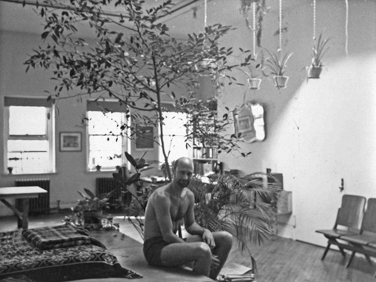
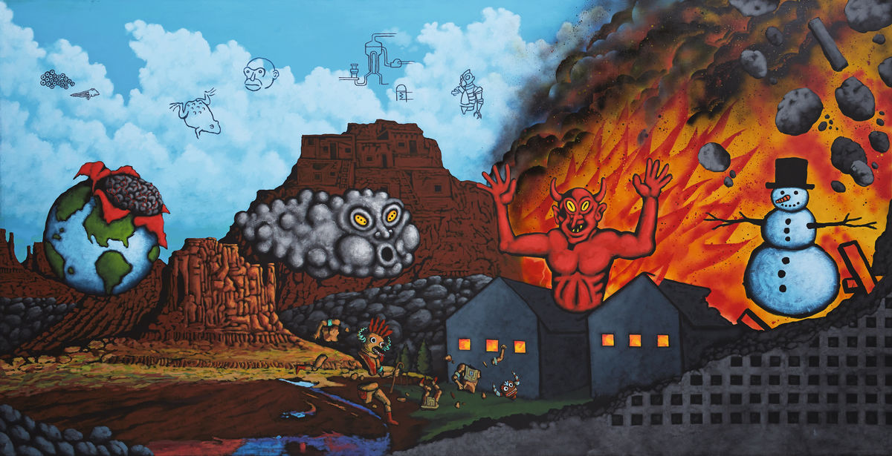
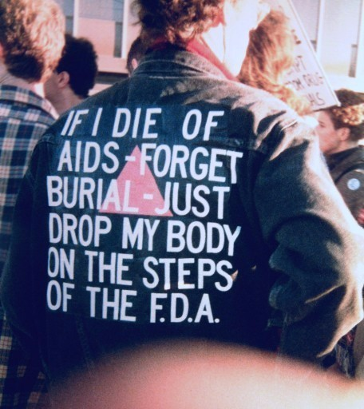

Lately I've been reading [_Before Pictures_](https://press.uchicago.edu/ucp/books/book/chicago/B/bo25012131.html), Douglas Crimp's memoir-cum-contemporary art critique that paints a vivid picture of 1960s and 70s New York: its art scene, its spaces for pre-AIDS public sex, its dangers and its possibilities. At the same time, a friend has been reading Patti Smith's _Just Kids_. Together, we've mused on the difficulties of conjuring a bygone New York, one in which working artists and writers in their twenties and thirties hop around between one another's SoHo lofts and rent is eighty dollars a month. An entire city reduced to financial terms: a lovely picture of Crimp sitting shirtless in his palatial Chambers Street loft—large enough to fit a literal tree-sized plant placed just behind him—stopped me short about midway through _Before Pictures_. The image was taken two years before Crimp became the managing editor of _October_. It created a temporary mental disjunct for me, calculating the current cost of a SoHo loft—which I don't actually pretend or want to know—with the annual salary of a managing editor of a theoretical art-crit quarterly. Likewise, shortly before moving to Clinton Hill earlier this year, I came across an article about Patti Smith and Robert Mapplethorpe's shared apartment, about four blocks from the room to which I'd shortly move, where they lived in the late 1960s. In _Just Kids_, Smith wrote that the apartment's "aggressively seedy" condition was "out of the range of experience"; the place now rents for $8,000/month. If the city is indeed a palimpsest and not the ship of Theseus, we can identify these relics of a bygone city, but it is more difficult to believe them. The mental gymnastics required seem, some days, impossible.

Crimp in his loft, c. 1975.

I felt a similar sense of discord when I visited [_David Wojnarowicz: History Keeps Me Awake At Night_](https://whitney.org/exhibitions/david-wojnarowicz) at the Whitney. The sweeping survey of the artistic output of David Wojnarowicz—who created paintings, photographs, sculpture, and music from the 1970s to the early 1990s, before his death in '92—conspicuously occupied, via the massive structure of the Whitney, so much of the unclaimed space of the West Side piers, whose dangers and sexual freedoms have been charted and documented by writers like Crimp and Wojnarowicz, among many others. The Whitney admits as much, but by way of a wow-what-a-coincidence aside in one of the exhibition's wall texts. In describing one well-known Wojnarowicz photo series, the text reads, "much of Wojnarowicz's work depicted the Meatpacking District—the very spot where you're standing right now!"

If it's difficult to imagine Manhattan as something other than the hypercommodified, Sweetgreened expanse it now is, it's even more difficult to determine what to do with art that in some ways allows us to experience New York as it formerly was, but falls short in so many other ways. I've been struggling with a way to process the Wojnarowicz exhibition since I saw it a couple weeks ago, in part because I felt a visceral distaste for most of the work on display. Is it that Wojnarowicz created some of the most searing documents of suffering and resistance within the height of the AIDS crisis in America, and I didn't want that work to be sullied by what I found to be uninteresting painting and sculpture? Was it merely, or mostly, the exhibition layout, which I thought was needlessly crowded and a bit nonsensical? Or is it just that I'm a snob who had a gut reaction to amateurish, non-academic painting? My reaction can likely be explained by all three. I do, at times, delight in bad work, especially the early bad work of artists I love: it first of all gives me a shred of hope, as someone who herself makes bad work, and it also tends to be recognizable and embarrassing and earnest in ways that the artist might not allow herself later in her career. Good and middling work surrounds us on all sides, but truly bad, truly ugly work is something special. (I'm reminded of the character Sholem in Sheila Heti's novel _How Should A Person Be?_, a painter sent into an existential tailspin by a competition among friends to create the ugliest possible painting.)

David Wojnarowicz, <i>Earth, Wind, Fire, and Water</i>, 1986. Acrylic and spray paint on canvas, 200 x 400 cm. Private collection, image courtesy Daniel Buchholz and Christopher Müller, Cologne; photograph by Nick Ash.

But the range of Wojnarowicz's work is enough to create whiplash. I launched into an existential tailspin of my own at the Whitney, leaving abruptly after feeling completely unable to comprehend what I was seeing and hearing. (I did love having temporary access to old recordings by 3 Teens Kill 4, the band Wojnarowicz was in in the eighties.) The exhibition itself is unable to get out from under the weight of Wojnarowicz's legacy as one of American contemporary culture's pivotal artist-activists: the Wojnarowicz of _David Wojnarowicz v. American Family Association_, the Wojnarowicz of "IF I DIE OF AIDS - FORGET BURIAL - JUST DROP MY BODY ON THE STEPS OF THE F.D.A." His activist activity is memorialized right up against his painting and sculpture, and the one body of work cannot be easily assimilated into the other. And it shouldn't have to: messiness, like ugliness, can be a treasure. But the messiness that attempts to assemble all of Wojnarowicz's methods, thought processes, and creative output under the sign of AIDS, against a formal critique that looks beyond the cultural context, or even the chronological facts, in which the work was created, is not a mess that interests.

Wojnarowicz at ACT UP's FDA Action protest, October 11, 1988. Photograph by Bill Dobbs.

At every moment possible in _History Keeps Me Awake At Night_, the Whitney seems eager to remind its audience of Wojnarowicz's activism, even or especially in moments when it seems to have little bearing on the work on view. Here, a summary of a gallery of his paintings:

In the mid-1980s Wojnarowicz began to incorporate his disparate signs and symbols into complex paintings. A fierce critic of a society he saw degrading the environment and ostracizing the outsider, Wojnarowicz made compositions that were dense with markers of industrial and colonized life. These include railroad tracks and highways, sprawling cities and factory buildings, maps and currency, nuclear power diagrams and crumbling monuments. Interspersed among them are symbols that he connected to fragility, such as blood cells, animals and insects, and the natural world. Wojnarowicz used these depictions as metaphors for a culture that devalues the lives of those on the periphery of mainstream culture. He made these paintings at a time when AIDS was ravaging New York, particularly the gay community. Although AIDS was first identified in 1981, President Ronald Reagan did not mention it publicly until 1985. By the end of that year, in New York alone there already had been 3,766 AIDS-related deaths.

Here, a loose set of signifiers is assembled through the specter of AIDS itself. Yes, curators and so-called memory institutions like museums are in the business of assembling information into a legible narrative—and, in the case of a retrospective, harnessing months or years or lifetimes of research into something more easily digestible for its publics. But something I so appreciated about Douglas Crimp's _Before Pictures_ was its frank inclusion of details that jutted out, raggedly interrupting a neat narrative of his life and curatorial and writing activity: a half-finished treatise on disco; ample "[sic]s" in excerpts of old writing, and plenty of acknowledgements of his own ignorance; memories he now finds "suspect" or uncertain. He does this, it seems to me, not out of a sense of modesty or self-deprecation, but from a commitment to fidelity and an acknowledgement of the messiness of life. These amendments, second guesses, and outright I-don't-remembers make up a life, a record—one person's record—of a place and time. I keep wondering what _History Keeps Me Awake At Night_ would have looked and felt like had the curators—overseers of the narrative of someone no longer able to speak for himself—been less sure of their interpretations. If we could simply look at Wojnarowicz's bad paintings as bad paintings; if they didn't have to buckle under the enormous pressure of acting as symbols of resistance and rage. If they were simply the documents of an individual struggling to form a visual language. If there were some way to assemble his work together without shoving it all uncomfortably into the category of Activist or even Good. If, in the contemporary institution, such messiness is even possible.

---

**Of note:**

_David Wojnarowicz: History Keeps Me Awake At Night_ is on view at the Whitney through September 30.

Douglas Crimp, "[Mourning and Militancy](https://ericastanleydotnet.files.wordpress.com/2012/05/mourning-and-militancy.pdf)" in _October_, 1989. A Wojnarowicz retrospective, in and of itself, is an impossible ontological situation: it is incumbent on institutions to highlight the crucial and ongoing work of AIDS activists, but its installation of his work has a deathly feel, as if its very position in the museum resists the possibility either of actual mourning, in Crimp's terms, or militancy.
