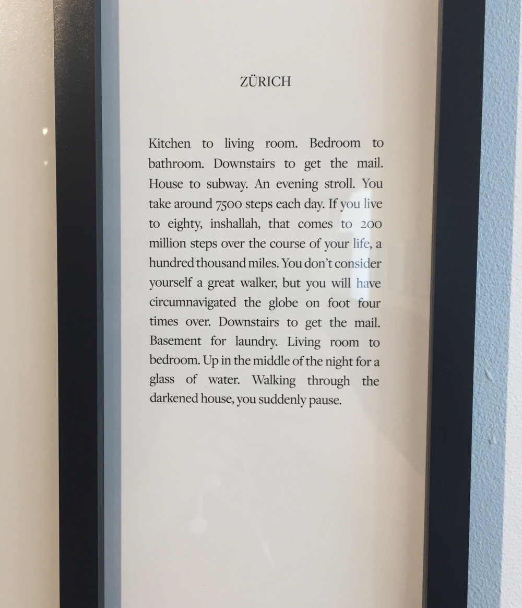

This year I began reading _My Struggle_ by Karl Ove Knausgaard, the six-volume chronicle of one Norwegian man's life. It was shortly after I'd attended a reading by Alexandra Kleeman, where she read selections from her most recent short story collection _Intimations,_  including one entitled ["You, Disappearing,"](https://www.guernicamag.com/you-disappearing/) which she explained was her attempt to render the apocalypse as mundanely as possible. The story focuses on The Disappearing, a slow-motion apocalyptic scenario in which things evaporate into thin air. Park benches, dogs, yes, but "concepts, memories, and modes of thought were just as vulnerable to erasure."

Teju Cole, <i>Basel</i>,  November 2014.

From the outset, as I dove into _My Struggle,_  it was obvious that Knausgaard and Kleeman have very different strategies for conjuring a readable mundanity. Where Kleeman consciously flattens a phenomenon that has been heightened and dramatized in every culture and in all conceivable ways, Knausgaard's material is already flattened. He elevates his subject matter, his life, insofar as he writes 3,600 pages about it, but otherwise his language and pace maintain a fidelity to that of everyday life. Even the most dramatic of struggles in _My Struggle_ are made quotidian, swept up in the great flow of Knausgaard's narrative.

In one section toward the end of the second volume of _My Struggle,_  Knausgaard writes that "indifference is one of the seven deadly sins, actually the greatest of them all, because it is the only one that sins against life." Though Knausgaard renders the events and emotions of his life with a writerly care, the sheer volume and breadth of what he covers has a further flattening effect on the tenor of _My Struggle._  Certain dramatic moments punctuate the narrative—Knausgaard's father's death, for instance, or the birth of his first child—but there is an overall indifferent affect in the deployment of Knausgaard's language. Several times Knausgaard expresses this indifference explicitly, whether for marriage, child-rearing, living in Sweden, living in Norway, being interviewed, smoking cigarettes—anything, in effect, that isn't the act of writing is subject to his cool detachment.

Teju Cole, <i>Capri</i>, June 2015.

It was my enjoyment of Knausgaard's mundane form as well as my distaste for his indifference—which often feels like a crutch or facade in _My Struggle_—that led me to feel an even greater appreciation for Teju Cole's exhibition _Blind Spot_ this past week even more than I might have already. [At Steven Kasher Gallery in Chelsea](http://www.stevenkasher.com/exhibitions/teju-cole-blind-spot-and-black-paper), Cole's framed photographs with sidebars of diaristic text were hung side-by-side, chronicling years of constant travel. As in Kleeman's "You, Disappearing," humans are almost completely absent from these scenes; with few exceptions we see them either from behind or not at all. I noted that Cole's writing was actually quite similar to Knausgaard's here, yet the way Cole apprehended the world felt strikingly dissimilar.

Each photograph is marked by the location in which it was taken. Some reach out, are missives, addressing you. One, entitled BEIRUT, reads,  *My darling. They said we wouldn't cross tonight. Now they say we must. My phone is dying. There is a pregnant woman here and she won't stop crying. I will send you a Facebook message tomorrow, inshallah.*  Where Knausgaard never breaks the illusion that he is unaware of a potential audience while writing, Cole speaks to himself, to his audience, and to lovers, sometimes all at once.

Detail of Teju Cole's <i>Zurich</i>, 2014.

To view _Blind Spot_ requires near-constant toggling between image and text; Cole's paragraphs are visually marginalized to a small column to the right of his photographs, and to regard each work in its entirety feels nearly impossible. It begins to hardly matter; one skims. Certain images grabbed my attention immediately, while others that I didn't care for so much were elevated to a similar status by means of their accompanying text. Cole's photographs seem certain and direct, but the text betrays uncertainty or a willingness to reconsider. An image of a boy in Brazzaville appears twice in the gallery with different text sidebars. Alongside its second appearance, Cole writes, "While preparing this book, I rescanned the negative of the boy by the Congo. 'His eyes disappear,' I had written. But all of a sudden, with slightly altered settings, I could now see his face, his eyes."

These are the small details embedded in the fabric of everyday life and of artistic production, but which rarely bubble up to the surface in a finished piece. Perhaps it was this uncertainty I found myself missing in _My Struggle_—not over marriage or having children or being a writer or buying a house, but over the project itself. Cole's work leaves room for indeterminacy: he invites us in to his own mundane diary, his travel journal, but writes the diaries of others too, leveraging _you_  for all it's worth.

Teju Cole, <i>Muottas Muragl</i>, July 2015.

The diaristic form made public assumes a level of broad interest in what are the granular particularities of one's life. This is made especially clear in the memoirs of celebrities, which end up being some of the most unremarkable and most profitable works on the market. Karl Ove Knausgaard initially took a bold bet that the same logic would apply to him, given a deep and insistent enough dive into his completely commonplace world, though he was not a celebrity at the time he wrote _My Struggle._  It worked, and now the series is curiously propelled by the same mechanisms of celebrity memoirs in a way that is difficult to disentangle from the writing itself. When his indifference (feigned or otherwise) becomes difficult to take, a project like Teju Cole's *Blind Spot* is a wonderful antidote: formally straightforward, it uses language to wrap around imagery and vice versa, making meaning out of the everyday in a way that manages not to feel overbearing. As Cole writes, "Meaning comes from the collective tension and balance of these individuated elements."

---

**Of note:**

"My Saga," parts [one](https://www.nytimes.com/2015/03/01/magazine/karl-ove-knausgaard-travels-through-america.html) and [two](https://www.nytimes.com/2015/03/15/magazine/karl-ove-knausgaards-passage-through-america.html), in which the New York Times commissions Karl Ove Knausgaard to travel through America by car and write about it. Total drudgery to read, and another interesting way to think of he and Teju Cole's work in conversation, since Knausgaard visits some of the same places Cole does in his photographs.

Zadie Smith, ["Life Writing,"](http://www.rookiemag.com/2015/02/life-writing/) *Rookie.*  Smith (incidentally, a huge fan of Knausgaard's) writes, "The dishonesty of diary writing—this voice you put on for supposedly no one but yourself—I found that idea so depressing...I realize I don't want any record of my days."
