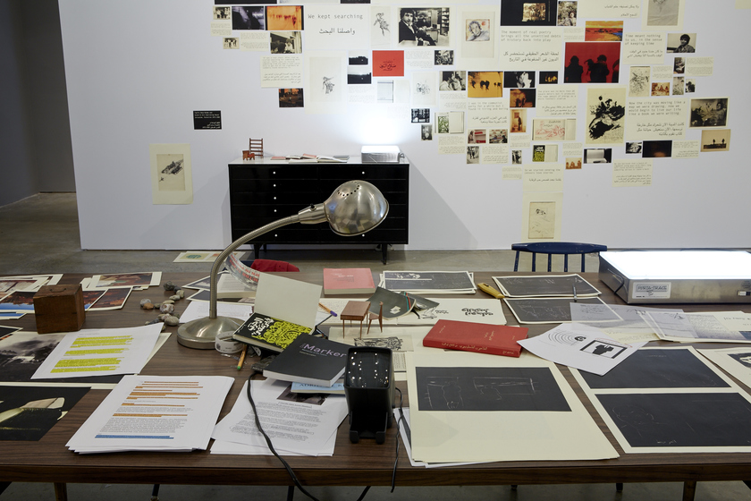
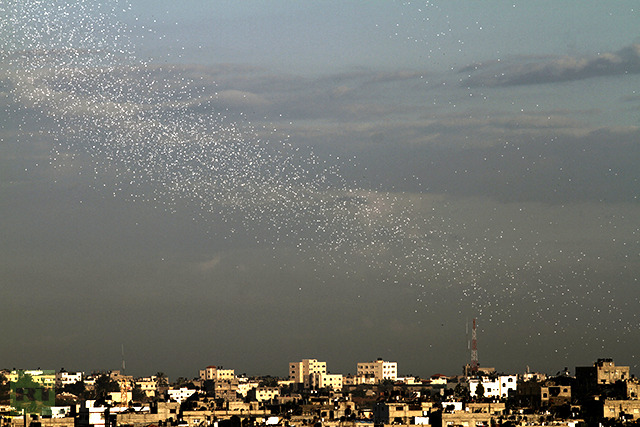
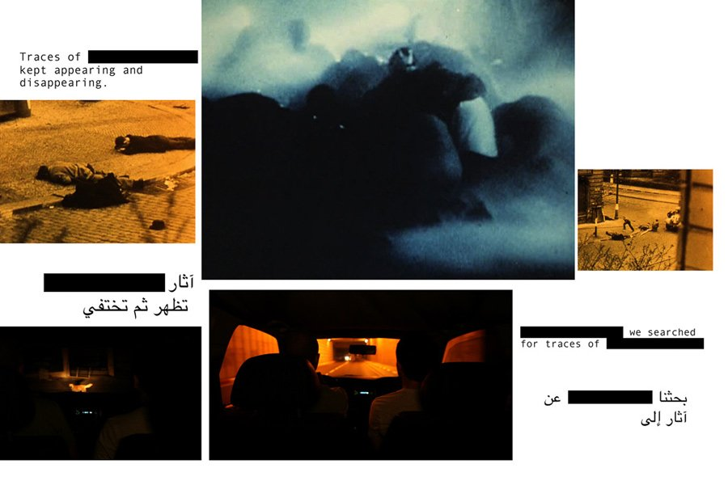
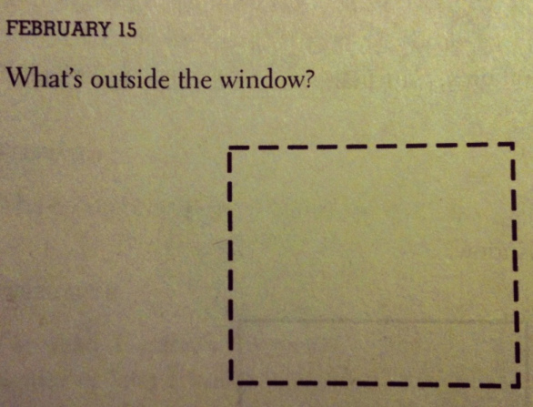

Perhaps the central paradox of the archive is that archival material gets in the way of the archive itself. Acquiring masses of paper ephemera, taming them, creating a legible narrative, digitizing the whole collection: these are the tasks of the contemporary archivist. Buried beneath material. The clutter itself poses a problem.

State-run archives are overburdened by material; as the process of whittling down is always unseen, what is actually a curatorial narration of the past appears neutral, a mere coincidence of the right documents interacting with one another in time and space to tell the story we already knew. Palestinian archival work poses a much different set of questions. The state archive—more or less inaccessible, its mechanisms rendered invisible and steeped in age and history—sees its foil in [_The Incidental Insurgents_](http://icaphila.org/exhibitions/6841/basel-abbas-and-ruanne-abou-rahme-the-incidental-insurgents), an ongoing multimedia installation by the Palestinian artists Basel Abbas and Ruanne Abou-Rahme.

_The Incidental Insurgents_—both the product of the artists’ archival research and an archive in and of itself—complicates spectatorial notions of what an archive is, how it should look and feel, the material it should contain. More importantly, though, Basel and Ruanne treat the materiality of the archive centrally, rather than as an impediment or an afterthought. *The Incidental Insurgents* resembles a cluttered workspace with no intention of becoming one day more organized. The installation spills: across time frames, across mediums, over walls and chairs and tables. Records are left spinning or they lie dormant, waiting for a passing visitor to activate the sound.

In a weekend-long publishing workshop run by Basel and Ruanne in early 2015, I was taken with the newness of their archive, especially compared to some of the material they encountered in their research. That weekend, we handled 18th century Islamic manuscripts and 20th century leftist pamphlets with the utmost care: more or less falling apart, the texts teetered between the workshop participants as we cringed to leaf through them. A few rooms over in the gallery space where *The Incidental Insurgents* was displayed, however, I rifled eagerly through the writings of Roberto Bolaño and Victor Serge; printouts of film stills from Godard and from the artists’ own video work; and pictures of historical Arab “bandit” figures, like the outlaw Abu Jildeh. My fascination with the exhibition was not so much with the notion of touching it in the first place—tactile engagement alone can’t dismantle institutions like perhaps we thought it could—but with the feeling of the paper itself. I recognized it. It was the feeling of paper freshly run through an inkjet printer. It was new.

Basel Abbas and Ruanne Abou-Rahme, <i>The Incidental Insurgents</i>, 2015\. Installation view at the Institute of Contemporary Art, University of Pennsylvania. Photo: Aaron Igler/Greenhouse Media.

Basel and Ruanne’s physical archive, smooth to the touch, resists the illusion of history. It’s an artistic refusal that foregrounds the sociopolitical reality of violence and erasure: how does one mine an archive already hollowed out by war and occupation? What happens when the colonial archive, with its deletions and partial erasures, tells a story that clashes so intensely with lived history? When the archive actually obfuscates the past instead of elucidating it (a fantasy we entertain of the recording of history), newness becomes a political strategy. Basel and Ruanne’s freshly printed archive is as much an act of creation in the face of a legacy of destruction as it is a reminder of that history.

In [_A Thousand Plateaus_](http://projectlamar.com/media/A-Thousand-Plateaus.pdf), Deleuze and Guattari understand areas of smoothness as spaces in which nomads—who move through space independently of the state—­operate. (Two particularly striking examples of organisms that move through space nomadically are rats and ­viruses.) Marked by the sporadic and “free” movement of nomads rather than a rational system of organization, this smooth space is “a space of affects, more than one of properties.” Alternately the bandit, a figure central to Basel and Ruanne’s work, becomes legible as such precisely because their actions are outlawed; their antagonistic relationship to laws and conventions—rather than their existing outside them—puts bandits in dialogue with the state. Basel and Ruanne seem to posit a coming-together of these two figures, a nomadic bandit whose strategies borrow from the legacies of both.

The materials within Basel and Ruanne’s installation are literally smooth to the touch, but the installation itself is a space that’s both smooth and striated, both of the state and apart from it. *The Incidental Insurgents* is not beholden to the organizational systems of the state archive, but its meaning may be fixed and frozen anyway by its position within the art institution and the museum’s tendency toward distillation (through wall text, through press summaries, through lectures, etc.). It’s an installation that resides in a single institution for several months, but also circulates globally without a permanent home.

It makes sense, then, that the materiality of *The Incidental Insurgents* encourages movement and even lines of flight. Basel and Ruanne’s avoidance of archival paper and deckled edges in their documents foregrounds not only smoothness but newness; one does not handle their archive with gloves. The thinness and casually composed nature of Basel and Ruanne’s inkjet-printed archive calls to mind paper material deployed in public space, like those of [IDF leaflet campaigns](http://www.npr.org/sections/thetwo-way/2014/07/13/331122214/palestinians-flee-gaza-after-israel-drops-warning-leaflets) warning Gazans of impending bombardment.

But where Israel drops leaflets in anticipation of state violence, Basel and Ruanne weaponize their paper ephemera against the state. Their installation is merely a materialization of an entire digital archive: it appears precarious, but is actually comprised of PDFs sturdier than a centuries-old document. *The Incidental Insurgents* seems to anticipate its imminent destruction, the material as easily disposable as IDF leaflets—the Palestinian print-on-demand archive may endlessly regenerate. The romance of history and one-of-a-kindness is reserved for the colonial archive, whose security concerns are distant and hypothetical. While the colonial archive in its physical form now faces the vast labor of digitization, the digital Palestinian archive is deployed physically at will. Its materialization serves as a warning signal.

IDF leaflet dropping over Gaza.

Yet *The Incidental Insurgents* is not assembled with recorded history as its central organizing principle. Rather, it is an archive organized affectively: characters and narratives meet thanks to a shared spirit. Grounded in the figure of the bandit, Basel and Ruanne have created a conceptual archive in which excerpts from *The Savage Detectives* mingle with newspaper clippings, Godardian film stills, and slogans from the memoir of Victor Serge. In our workshop, Basel cited the “identical feelings” between revolutionaries in Paris in 1910 and Palestine in 2011. Is this the new archive: one that feels? *The Incidental Insurgents* is an archive whose materials swirl around a nucleus: not an event, a nation, a religion, or a language, but a strategy of resistance.

In this space, unlikely characters interact. In Part Two of the installation, *The Part About the Bandits*, what begins as a narrative of the outlaw Abu Jildeh’s capture is interrupted by the fictive outsider-poets of _The Savage Detectives_. “I’ve been cordially invited to join the visceral realists,” the text—in side-by-side English and Arabic—reads. “I accepted, of course. There was no initiation ceremony. It was better that way.” This foregrounding of fiction in the archive actively pushes against the notion of a monolithic history that is objectively recordable. The documents constantly toggle between pronouns. As a methodology, it reinscribes and reaffirms the personal narrative as a document worthy of inhabiting an archive.

The archive that intermingles the fictive with the “real” also recalls Golda Meir’s famous assertion—repeated before and since in so many different ways—that Palestine does not exist. It seems that these Palestinian artists, instead of taking an oppositional stance to the sentiment, actually agree with Meir. Her statement is an utter negation of a state and a people, but Basel and Ruanne’s relationship to that erasure is generative. Instead of linking Palestinianness essentially to statehood, Basel and Ruanne assemble an imaginative archive in which Palestine is understood through actions and emotions rather than citizenship or lack thereof. Palestine has been denied the right to exist, its paperwork destroyed, so a Palestinian archive may as well include the account of an anarchist in Paris in the early 20th century, or of fictional poets in Mexico City. Why not?

A line from Part Two of *The Incidental Insurgents* reads, “Unwilling to be MASTERS or SLAVES, they became bandits.” For Basel and Ruanne, banditry arises from the limitations of this binary. It seems the only way to opt out is to intentionally exist on the margins. In their installation, Basel and Ruanne bring together bandits who often worked autonomously—Victor Serge, Abu Jildeh, the Visceral Realists—under the sign of a Palestinian archive. It’s a recontextualization of these various figures as having pertinence to the Palestinian narrative, but perhaps more significantly, it underscores the shifting coordinates of Palestinian national identity itself.

In organizing an archive around the figure of the nomad-bandit as one that elucidates Palestinian history, *The Incidental Insurgents* maps the figure of the nomad onto Palestinianness itself. Stateless by definition, the nomad migrates through smooth space in spontaneous and unplanned ways. Palestinians, as opposed to Deleuze and Guattari’s theoretical nomad, are strictly policed and surveilled by the state whose tactical-military arm [infamously looks to weaponize the very same theories](#). However, we might understand the Palestinian archive as one that migrates, a deterritorialized collection of affinitive bodies that exists outside highly rational systems of organization.

<iframe src="https://player.vimeo.com/video/108653337?h=638cea8439&title=0&byline=0&portrait=0" width="512" height="288" frameborder="0" allow="autoplay; fullscreen; picture-in-picture" allowfullscreen></iframe>

As Palestinian artists, Basel and Ruanne are also confronted with binary systems that allow them to speak and be heard only in certain ways, just like the bandits they highlight. Western media, which traffics alternately in disaster pornography and anti-Palestinian fearmongering, knows these binaries well. As consumers of these images, the Western audience is familiar with images of Palestinians accompanied by the endless material of their landscape. Visual representations of Palestine are dominated by detritus, material, rubble. A quick Google search of “Gaza” yields images only of destruction, the endless gray-brown of ruin and the Palestinians trapped beneath it, running from it, screaming at it. In this demolished landscape, Palestinians are portrayed either as helpless victims buried in debris or suicide bombers, perpetrators of the kind of violence that forces others to dig themselves out of the ruins.

This visual tradition can be found not only where we expect it—Western media sources—but also in mainstream films made by Palestinian writers and directors. Hany Abu-Assad’s _Paradise Now_, perhaps the most internationally popular Palestinian film of the 21st century, chronicles the daily lives of two suicide bombers preparing to self-detonate in Tel Aviv. Annemarie Jacir’s _Salt of This Sea_, on the other hand, features young Palestinians trapped in Ramallah, burdened by the physical artifacts of a pre-1948 Palestine, objects imbued with so much political and nostalgic significance they threaten to halt forward momentum entirely.

The demands of neoliberal spectatorship require the Palestinian artist to perform the roles of creator and translator both, all with a measured cadence, composure, and a neatly packaged politics that neither sympathizes with Israel nor makes frightening interventions in western liberal ideology. Tone exists at the heart of this issue; the protagonist of *Salt of This Sea* was lambasted in [an NPR review](http://www.npr.org/templates/story/story.php?storyId=129082782) as being “little more than a mouthpiece for history lessons on the injustices perpetrated on the Palestinian people.” Elia Suleiman’s _Divine Intervention_, equally forthright about the necessity of violent resistance, nonetheless enjoyed more nuanced critique from Western spectators because of its art-house aesthetic and almost nonexistent dialogue. It’s a matter of what kind of didacticism is appropriate, when it is warranted, and what kinds of resistance prove too difficult for the western audience to fully embrace.

Basel and Ruanne seem to share more in common with Suleiman than they do with Jacir; as multimedia artists who translate their work in anticipation of Western spectatorship and who challenge the status quo without uprooting it, Basel and Ruanne do not pose a threat to their spectator. Furthermore, *The Incidental Insurgents* is neither static, nor is it merely an archive; it is an installation, and circulates as such in the international art market. There are different expectations of an installation like *The Incidental Insurgents* than of a state archive, and its relationship to capital also differs greatly: Basel and Ruanne won both the 2015 Sharjah Biennial Prize and the 2016 Abraaj Group Art Prize, a $100,000 award. (This kind of reception from the Gulf states is significant: it’s not just the western world that is taken with Basel and Ruanne’s not-explicitly-confrontational approach to art and archival work.)

Circulation both local and global is significant for an installation of this kind, which issues forth from a nation whose archives are widely scattered. Many historic Palestinian documents are housed in the British and Israeli national archives, hopelessly inaccessible to Palestinian citizens. An archive created and curated by Palestinians is a new phenomenon in a landscape dominated by state-run colonial archives on the one hand and small, individual collections of paper ephemera on the other. In its ability to move and rematerialize as a work of art, *The Incidental Insurgents* might be far more accessible than any centralized database.

Moreover, Basel and Ruanne’s detournement of the archive, which remixes history and collapses boundaries of real and fictitious, represents a paradigm shift not only in archival practices, but also in the Palestinian relationship to paper ephemera. It seems the Palestinian is always either buried or burying, destroying or destroyed. *The Incidental Insurgents* finds no comfortable home within these binaries that dominate visual representations of Palestinianness. The materiality of the installation becomes an all-important subject of its own, the sheets of paper themselves rewriting a history of Palestine just as much as the tales of Abu Jildeh’s exploits. *The Incidental Insurgents* not only accepts but embraces piles of clutter and sprawl; likewise, its material newness complicates its relationship to more traditional archives, which are generally only curated, not created anew.

Basel Abbas and Ruanne Abou-Rahme, <i>The Incidental Insurgents: The Part About the Bandits, Part II,</i> 2012-13.

Within this visual tradition of the buried or burying Palestinian, Basel and Ruanne, unwilling to align unproblematically with either creation or destruction, instead enact a banditry of their own. Their sampling of material from various cultural instances of banditry is a piece-by-piece method of understanding Palestinian identity; these various sources, linked by a revolutionary spirit, interact in the archive to iterate the slipperiness of Palestinian nationality in the face of statelessness and occupation.

In _The Savage Detectives_, Roberto Bolaño poses a question, iterated three times: *What’s outside the window?*  This is how his novel ends, with three questions and three small pictographs alongside the text, simple rectangles. They could be windows, but they also look like sheets of paper aligned horizontally. The border of the third rectangle is a dotted line. Each time I look at it, I’m tempted to cut out the shape. My copy of *The Savage Detectives* is warped from an afternoon spent outdoors in a rainstorm, its pages like dead leaves, and I imagine the sound the final page would make if confronted with a pair of scissors.

Bolaño’s question—which both literalizes and abstracts the window—is a question central to Palestinian visual and cultural production. One recalls Vivian Sobchack’s theory of cinema as serving the function alternately of a window, frame, or mirror. This tripartite model has a stranglehold on othered artists; they’re forced to play the role of tour guide, or to up the relatability factor in their work for western audiences. Basel and Ruanne’s refusal to engage with that violent form of spectatorship involves not smashing the window but covering it up with something just the right shape and size: a piece of paper.

There are times when the corpus of the archive converses with the human body in ways that are almost sublime. Ruanne recalls that at some point in their research for _The Incidental Insurgents_, the two ended up searching for the bandit Abu Jildeh’s grave: “We learned that Abu Jildeh’s grave was unmarked. He was buried in an unmarked grave. His family members told us his body had been moved at some point…I was shocked and said, ‘If anyone comes searching for AJ, they won’t be able to find his grave.’” She then recalls, “When we came back 10 days later, they had made a proper grave for AJ, with his name and an inscription.” In Basel and Ruanne’s workshop, the artists shared pictures they’d taken of that second visit as they bore witness to the official recognition of Abu Jildeh’s buried body. All that digging had led them there, to an unassuming, sloping backyard in a Palestinian village. Perhaps they felt a momentary weightlessness.

---

**Of note:**

Eyal Weizman, ["The Art of War,"](https://frieze.com/article/art-war) Frieze. I linked to this in the piece already, but this is an unbelievable exploration of how 20th-century philosophy (Deleuze and Guattari in particular) have been mined and weaponized by the IDF. A retired Brigadier-General explained to the author, "Several of the concepts in *A Thousand Plateaux* became instrumental for us, allowing us to explain contemporary situations in a way that we could not have otherwise...in the IDF we now often use the term 'to smooth out space' when we want to refer to operation in a space as if it had no borders. Palestinian areas could indeed be thought of as 'striated' in the sense that they are enclosed by fences, walls, ditches, road blocks and so on."

Basel and Ruanne's [Vimeo account](https://vimeo.com/ruanneandbasel), where many of their video works are accessible.

Tony Romm & Nancy Scola, ["Trump's fleeting tweets alarm archivists,"](http://www.politico.com/story/2017/02/trump-tweets-archivists-234635) Politico. Much as I don't want to talk about Trump's Twitter, it is interesting in revisiting this piece to consider the immediacy of the print-on-demand tactic described above applied to a completely different set of circumstances, in the service of totally different politics. The archival practices in both the case of Basel & Ruanne and of the archivists in this piece feel utterly urgent, but the methods used are so different.
