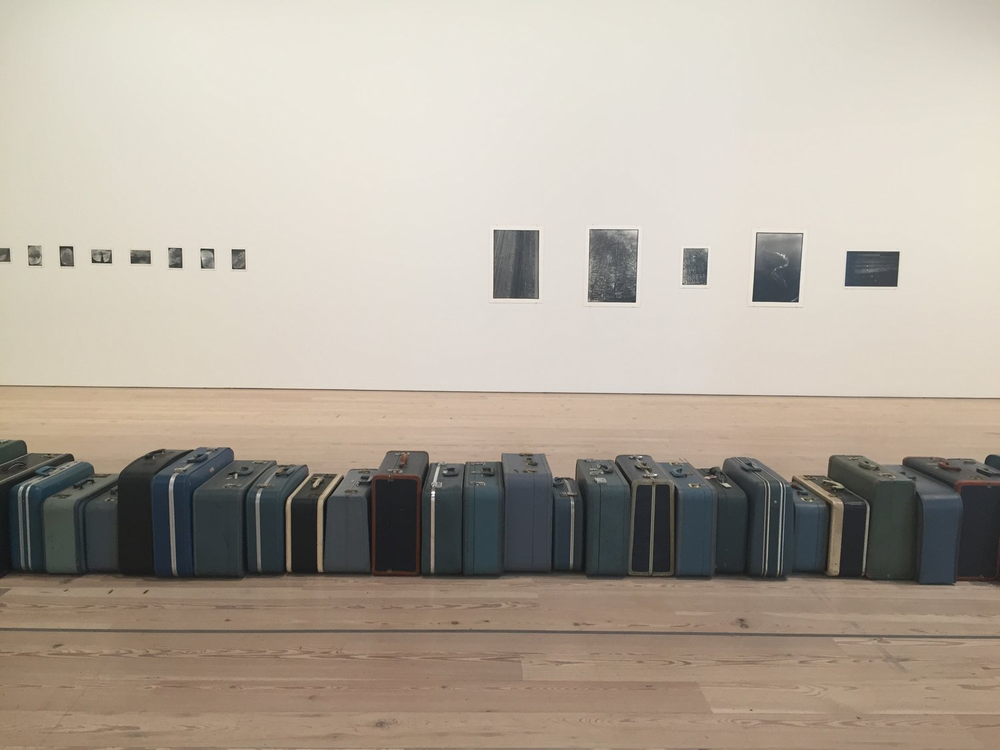
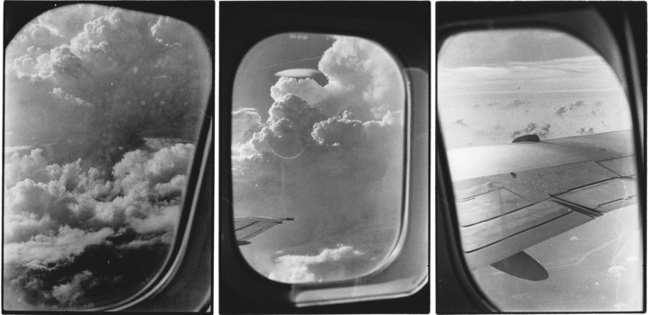
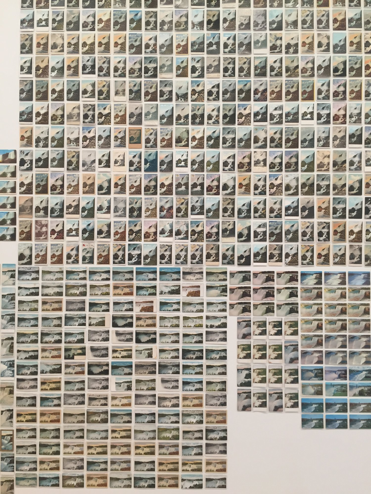
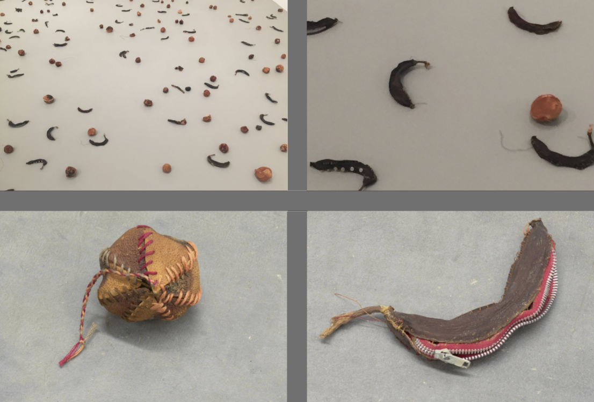
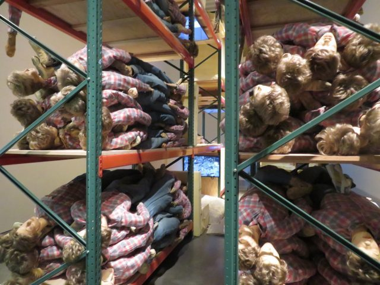
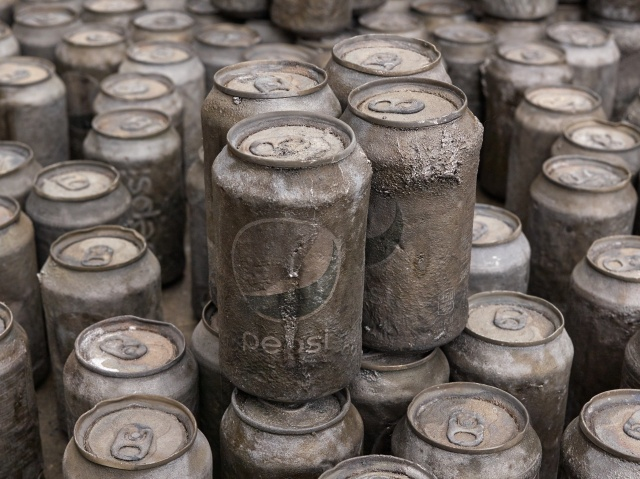

[_Zoe Leonard: Survey_](https://whitney.org/exhibitions/zoe-leonard), the major overview of Zoe Leonard's three decades of artistic production, just closed at the Whitney, and I have found myself returning to it in my mind frequently in the month since I saw the exhibition. It was a near-perfect day in early May, and after the Whitney closed, I walked over to the Cubbyhole, one of New York's last remaining lesbian bars, for a late-afternoon beer. Once there, I stared at the ceiling for a while. It's completely covered in paper lanterns, bunches of plastic grapes, beads, chandeliers, strings of lights, and little toy animals. Against the grain of most establishments I frequent, whose aesthetic could generously be described as _spare_, the Cubbyhole embraces its own maximalist sprawl to the fullest. There's something comforting about being surrounded by so much stuff, especially when the stuff is not your own. It's possible I felt a bit of this reassuring hum in _Zoe Leonard: Survey_, too.

With only five blocks between them, the Cubbyhole and the Whitney couldn't be more different: one costs $25 to enter, while the other gets you a margarita for $2; one is lofty, white-walled, gigantic, and underwritten by millionaires while the other is dark, tiny, and filled to the brim with tchotchkes. Yet I could plausibly see Zoe Leonard's work exhibited in either space. Leonard, perhaps best known for her 1992 text piece [_I want a president..._](https://iwantapresident.wordpress.com/i-want-a-president-zoe-leonard-1992/), which enjoyed renewed viral traction up to and beyond the 2016 US presidential election, is a sculptor and a gatherer. Her works, as selected and installed for _Survey_, are the accumulations of a steady hand and an archivist's sensibility: stacked books and suitcases, hundreds of nearly identical postcards, photographs looking out of an airplane window.

Partial view of Zoe Leonard's <i>1961</i> (2002–ongoing) at the Whitney. Leonard adds a secondhand suitcase to the sculpture for each year of her life that passes.

The creation and existence of this untitled series of airplane photographs from 1989 produced anxiety in Leonard, who was active in ACT UP during the same period. As the story goes, David Wojnarowicz assuaged some of Leonard's worries. "I felt that making art was this incredibly indulgent thing, and the work that I was making felt so far away from the reality of what was happening," Leonard recalls in a [1997 interview](https://www.anthonymeierfinearts.com/attachment/en/555f2a8acfaf3429568b4568/Press/555f2b29cfaf3429568b5c35) with Anna Blume. "I remember one time having lunch with David Wojnarowicz, and I had these small work prints of clouds with me. And I was showing them to him and I was almost crying. I was like, 'David, what the fuck am I doing?'...he said—I'm paraphrasing—'Don't ever give up beauty. We're fighting so that we can have things like this, so that we can have beauty again.'"

Zoe Leonard, untitled airplane windows, 1989. Courtesy Galerie Gisela Capitain, Cologne, and Hauser & Wirth.

Perhaps what bubbles more strongly to the surface in my read of Leonard's work, however, is not only the creation of space for beauty, but a politics of proliferation, a sort of tactic of the multitude. I'm still struggling with a way to articulate this, and in struggling I have begun to think of another artist whose work I've spent time with in the past year, Kaari Upson. Upson's work was featured in the 2017 Whitney Biennial, but specifically here I'm thinking of [_Good thing you are not alone_](https://www.newmuseum.org/exhibitions/view/kaari-upson), the artist's solo show at the New Museum that ran from May to September of last year. The exhibition's nucleus was a work called _Idiot's Guide Womb Room_, a massive sculpture that recreated the experience of wandering through the aisles of Home Depot or Costco, if Home Depot shelves were populated with identical stuffed life-size dolls and scores of _Idiot's Guide_ books.

Detail of Kaari Upson's <i>Idiot's Guide Womb Room</i> (2016–2017) at the New Museum.

_Zoe Leonard: Survey_ didn't feature _Idiot's Guides_—not exactly—but one of the Whitney's galleries was dedicated solely to a sculpture called _How to Make Good Pictures_, in which Leonard stacked various editions of the eponymous how-to book into piles of differing sizes. It was this surface-level similarity that first jogged my memory of Upson's 2017 New Museum exhibition, and what made me consider more carefully the possible throughlines between both artist's works.

By turns Warholian and Duchampian, the work of Leonard and Upson mobilizes various visual and material strategies from both forebears: the readymade (suitcases, postcards, shelving, how-to books), the duplicable multiple, massive presentation techniques, and obsessive seriality. The work of both artists has been framed explicitly in terms of trauma, both by the artists themselves and in their critical reception: discussion of Leonard's work tends to focus on the AIDS crisis, and of Upson's, her mother, who escaped East Germany in her youth, fled to America, and found solace in its big-box abundance. I wonder whether there is room to hold the traumas central to the lives of both women close while looking at their work and to also push back against interpretations of their work solely as exercises or exorcisms of the same. After all, neither Leonard nor Upson is a "reproductive machine" ([Baudrillard's memorable term](https://archive.org/details/BaudrillardJeanSelectedWritingsOk) to describe Warhol's artistic transformation), but neither should their work be divorced entirely from the clean, masculine gestures of mass reproduction enacted by Warhol or more recent practitioners like [Jason Rhoades](https://icaphila.org/exhibitions/jason-rhoades-four-roads/).

Zoe Leonard, <i>You see I am here after all</i>, 2008. Vintage postcards.

Occupying this uneasy middle ground, the work of Leonard and Upson swings from a hoarder's to a craftsman's sensibility and back again. Leonard's _Strange Fruit_, in a room all to itself, was, for me, the highlight of _Survey_—both because I'd seen so many images of it before but viewing it in person was something entirely different, and because it felt emblematic of this uneasy, beautiful proliferative strategy. Comprised of hardened fruit peels stitched together by the artist and spilled all over the floor, _Strange Fruit_ is at once abundant and sparse, somber and anti-monumental. The peels are shrunken and small, and what is usually grabbable within arm's reach here evades us. In the time I spent in the _Strange Fruit_ room, more than one visitor walked in and began to laugh, almost involuntarily. The peels are pathetic. Together, they coalesce into something larger than their constitutive parts, but the constitutive parts are still trash. The installation, dedicated to Wojnarowicz, is quiet. One might read it as an elegy, which it is, but it's also difficult not to think of the [iconic protest image](https://www.frieze.com/article/stitch-time-0) of Wojnarowicz's mouth sewn shut.

Though the rest of the Whitney exhibition—suitcase multiples, walls of postcards, stacks of books—ostensibly engenders a more playful, tongue-in-cheek mode than _Strange Fruit_ specifically, I similarly read it in a tone of protest and exhaustion, even if the subject of Leonard's protest isn't immediately evident. _You see I am here after all_, a massive installation of hundreds of similar vintage postcards from Niagara Falls, is a Duchampian gesture, a work of art in the age of mechanical reproduction, a critique of the commodification of natural landmarks, sure, but its dominating affect, for me, is one of fatigue. Like the suitcases across the hall, the postcards mark the passing of time more than anything, sepia and all. The work of the documentarian is ceaseless, and especially tiring when the issues Leonard has been fighting for decades, like the criminalization of HIV/AIDS, have not radically improved. Concurrent with _Zoe Leonard: Survey_ was the ongoing [_An Incomplete History of Protest: Selections from the Whitney's Collection, 1940–2017_](https://whitney.org/exhibitions/an-incomplete-history-of-protest) in a downstairs gallery, which featured several protest posters and artwork from the 1980s and 90s addressing the negligence and cruelty of the US government in its inaction throughout the (ongoing) AIDS crisis. When Leonard's work is placed in tonal opposition to these selections, only the existing systems of power benefit.

Meanwhile, Kaari Upson's work at the New Museum, which deployed many of the same material strategies as _Zoe Leonard: Survey_, was received very differently. Christopher Bollen, in _Interview_, [called](https://www.interviewmagazine.com/art/kaari-upson-1) her work "tactile, body-centric, and violently assertive," an assessment that is likely due, at least in part, to the artist's head-on self-imaging within the exhibition, as in the video _Recluse Brown (Pepsi Chair)_. In fact, I'm not sure the tone of Upson's installation was all that different from that of Zoe Leonard. Like Leonard, Upson repurposes trash, selectively displays found objects, mines originary traumas, and stacks identical objects one on top of the other. Petrified cans of Pepsi were scattered throughout the space, as well as the _Idiot's Guide_ books, which, when placed together en masse, resembled a nearly illogical range of interests, investments, and questions. Most haunting were the stacks of stuffed figurines on the prefab shelves of _Idiot's Guide Womb Room_, dressed in the likeness of Upson's character in various videos throughout the exhibition ("a prosthetic mom, a substitute maternal figure," in Upson's words). Upson [has described](https://news.artnet.com/art-world/kaari-upson-cats-costco-mother-sculpture-1035392) the importance of the repetition and abundance of spaces like Costco in her practice "for presenting this psychic visual endlessness—as though it could just keep going and going."

This endlessness—or illusion of it—is key to my understanding of Leonard's and Upson's artistic practices and installation methods. If their works are indeed animated by grief and trauma primarily, let this overwhelming proliferation of material be a testament to trauma's ongoingness, to grief's vast reach. Perhaps what I am advocating is a discursive swap between the work of these two artists: that Leonard's work register more angrily, more as a protest and less like a quiet elegy whose underlying politics can easily be swept to the side; and that Upson's work be read more seriously as an elegy, a lamentation, despite its several laugh-out-loud moments. Through a reclassification, we might be able to disrupt our notions of what qualifies as a protest, why grief need be rendered somberly, and which expressions of trauma are subsumed by institutional installation. In their insistence on material proliferation, both Zoe Leonard and Kaari Upson resist this subsumption in the first place.

---

**Of note:**

Another exhibition I saw more recently, *[Adrian Piper: A Synthesis of Intuitions, 1965–2016](https://www.moma.org/calendar/exhibitions/3924),* at MoMA, displays many of the same characteristics of what I discuss with regard to Leonard and Upson (seriality, proliferation)—and the survey contains an absolutely staggering amount of work. What Piper's work is doing is, however, different enough from these two that it merits separate discussion. *A Synthesis of Intuitions* is on view through July 22.

Strangely enough, reviews of *Zoe Leonard: Survey*  tend to focus on or at least mention Instagram—in particular, the refreshing un-Instagrammability of her work. In the _New York Times_,  Holland Cotter [writes](https://www.nytimes.com/2018/03/08/arts/design/zoe-leonard-photographer-sculpture-whitney-museum-of-american-art.html), "I don't know Ms. Leonard's thoughts on all this, but I'm glad she makes art that is not natural Instagram fodder. I'm glad she makes us linger, makes us ask 'what's going on here?'" An article titled ["Why Zoe Leonard Is the Artist We Need in Today's Instagram-Addled Age"](https://news.artnet.com/exhibitions/zoe-leonard-whitney-review-1234703) on *artnet* doesn't answer the title's own prompt, but the closest it comes is as follows: "In an era of endless distraction, Leonard's work demands that you pay attention. That's the only way you can reap its rewards." Andrea Scott's *New Yorker*  [review](https://www.newyorker.com/magazine/2018/04/09/zoe-leonards-radical-evidence-of-the-overlooked) of the exhibition mentions social media in the first sentence. Not only does the focus make me feel like I've missed something—the connection between Leonard's work and social media is not at all apparent to me (apart from the viral spread of _I want a president..._), nor is the conviction that she specifically will be the one to "pull us out of our Instagram-addled complacency" particularly convincing—but on a purely technical level, it seems to just be untrue. The installation at the Whitney's beautifully lit, capacious galleries seemed, if anything, more Instagrammable than the average exhibition, and everyone around me had their phones out, documenting. Funnily enough, I think Upson's exhibition is the one that seemed to resist direct translation onto social media, if not thematically, then at least technically. I found *Idiot's Guide Womb Room*  frustratingly impossible to photograph when I visited, and haven't found any photographs online that convey the richness of its installation. Instead, I documented it in a piecemeal fashion at the New Museum, only able to capture its various parts rather than the whole.
