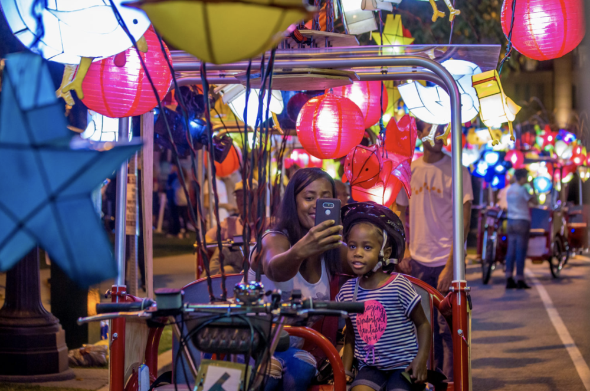
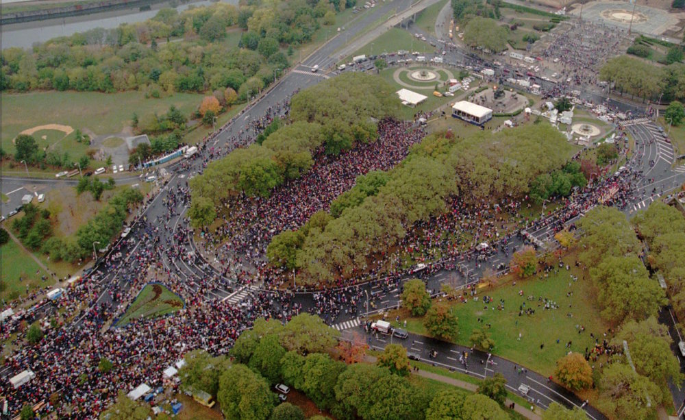
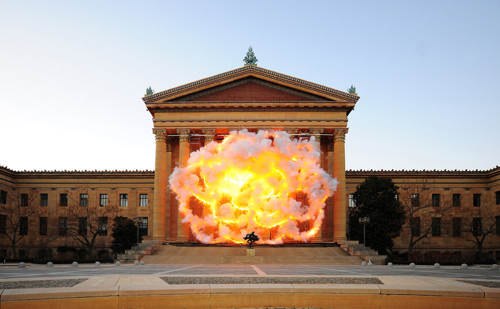

Public space has always been a contested realm; the questions of who is seen, heard, and permitted to take up space feel eternally relevant. These are, in short, questions of power, and which groups wield it. In 2017, however—with its political spectacles, airport sit-ins, massive protests, and monuments both toppled and fixed—American public space is uniquely fraught.

In a new public art initiative called _[Fireflies](http://www.associationforpublicart.org/project/cai-guo-qiang-fireflies/),_ Chinese artist Cai Guo-Qiang seizes the potential energy of a year that not only marks unprecedented political unrest but also the centennial of Philadelphia’s Benjamin Franklin Parkway, where _Fireflies_ is staged through mid-October. On the September 14 opening celebration of the project, a fleet of pedicabs took to the main artery of the Parkway with a synchronized performance that lit up the darkened streets with Chinese lanterns of all shapes and sizes. The musical accompaniment to the performance was, somewhat confusingly, a rendition of the official [Pennsylvania state song](https://statesymbolsusa.org/symbol-or-officially-designated-item/pennsylvania/state-song/pennsylvania), an assertively nationalist tune. “This is my way of giving back the Parkway to the people,” Cai remarked via a translator, and the crowd cheered.

  Visitors at the public opening of <i>Fireflies</i>, September 14, 2017. Photo: Jeff Fusco.

In Philadelphia, there is perhaps no better place than the Parkway to observe the apparent contradictions of space deemed public. At its northwestern head sit many of Philadelphia’s most storied and esteemed institutions: the Philadelphia Museum of Art, the Rodin Museum, the Barnes Foundation. Follow the Parkway southeast and it will spit you out at Love Park, home to both Robert Indiana’s iconic _LOVE_ sculpture and to one of the city’s most visible homeless populations. The massive gatherings of people on the Parkway have felt just as dissonant this year, from January’s fifty thousand-strong Women’s March to April’s NFL Draft to the Made in America music festival held over Labor Day weekend.

  The January 2017 Women's March on the Benjamin Franklin Parkway in Philadelphia. Photo: George Widman.

Among that roster of public gatherings, where does _Fireflies_ fit in? At the opening celebration, it was difficult to tell. In remarks that preceded the performance, representatives from Philadelphia’s Association for Public Art underscored the importance of people coming together to simply come together, to be joyous and free.

As Cai’s pedicabs—the bright fireflies in question—whirled around the Parkway, the performance felt less like a salve or an answer to the insistent questions sparked by this particular slab of land in Philadelphia, and more like part of the rich palimpsest of the city’s streets. Indeed, I felt most joyous as I watched the wonderment of the babies and children in attendance, for whom this display really seemed to function.

Cai's previous work on the Parkway, at the Philadelphia Museum of Art (<i>Fallen Blossoms</i>, December 11, 2009, 4:30PM, 60 seconds, gunpowder fuse, metal net for gunpowder fuse, and scaffolding). Photo: Lonnie Graham.

The pedicab rides available to the public through mid-October have already sold out, limiting the participatory aspect of the project to a small segment of the population. The rest of us are left to wonder, again, about the efficacy of aesthetically beautiful work in addressing what it means to be a citizen, and whether one of the artist’s signature [gunpowder explosions](#) might have been more fitting for the times in which we live. _Fireflies_ was a lovely, sparkling flash of a moment in the long history of Philadelphia’s public spectacles, but as for “giving the Parkway back to the people,” its ownership will seemingly always be contested.

[This article was originally published in the _Art21_ Magazine.](http://magazine.art21.org/2017/09/19/philadelphia-illuminated/#.WcEscpN948Y)

---

**Of note:**

Meredith Sellers, "[Philadelphia's Fight to Remove a Monument to Former Mayor Frank Rizzo](https://hyperallergic.com/397058/philadelphias-fight-to-remove-a-monument-to-former-mayor-frank-rizzo/),"  *Hyperallergic.* Between the Rizzo statue, Nathan Rapoport's Holocaust memorial, and _Jesus Breaking Bread_ by Walter Erlebacher, the vast array of statues and monuments on the expanse of the Parkway speaks to the competing desires and investments that "public space" can simultaneously hold.

A concurrent Philadelphia public art initiative, [Monument Lab](http://monumentlab.muralarts.org/), proposes city monuments that might dwell outside of the hegemonic imagination of the state. Sharon Hayes' *[If They Should Ask](http://monumentlab.muralarts.org/sharon-hayes),* for example, points out the absence of monuments to women in Philadelphia; Kaitlin Pomerantz's *[On the Threshold (Salvaged Stoops, Philadelphia)](http://monumentlab.muralarts.org/kaitlin-pomerantz)*  repurposes stoops from recently demolished buildings and refashions them in one of Philadelphia's most moneyed neighborhoods.
