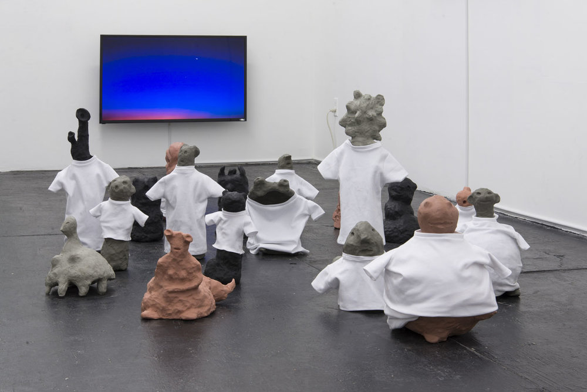

What does it mean to be tired?

In Virginia Woolf's journals—diaries?—she describes tiredness as a kind of shrinking. For her, it is almost always associated with pain: usually physical (headaches, soreness), but also emotional. Woolf's fatigue is a negation of her own "genius" and perhaps the main way in which she's extracted from the realm of the cerebral and back into that of the body and its incessant demands. "This I did," she writes, as she admitted to herself that the proofs of _The Years_ were "so bad" and handed them over to her husband Leonard. "And a weight fell off my shoulders...now I was no longer Virginia, the genius, but only a perfectly magnificent yet content—shall I call it spirit? A body? And very tired. Very old."

In these writings, Woolf seems frequently tired, frequently pained in a way that is familiar to anyone prone to depression naps, yet the frequency of this modality consistently surprises her and shakes her off balance. In 1928, she wrote, "Never was anyone so tossed up and down by the body as I am, I think." Ten years later, in 1938, with the world on the brink of total war, she would write, "I don't feel that the crisis is real...of course, we may be at war this time next week." For Woolf, physical exhaustion and political anxiety always brushed shoulders but never really unified into a cohesive front.

Woolf's descriptions of fatigue always point inward toward the body or semi-inward toward her own writing rather than elucidating something more about the external political situation or even her politics themselves: in 1940, on the third day of the Battle of Waterloo, Woolf writes, "The war is like a desperate illness. For a day it entirely obsesses: then the feeling faculty gives out; next day one is disembodied, in the air."

Installation image from <i>Soc or Barb</i>. Photo courtesy Bodega.

Enter Hannah Black's show _[Soc or Barb](http://bodega-us.org/soc-or-barb.html)_ at Bodega on the Lower East Side. It was the first thing I saw while in New York for the day, and I left the gallery feeling extremely despondent, probably tired too. The installation was sparse: three screens mounted on different walls, one alarm clock on the floor set to 00:00, and a cluster of clay sculptures on the ground, little lumpy (lumpen?) quasi-human forms wearing small white t-shirts. There were two mounted speakers, out of which came an audio loop that featured a disorienting selection of clips: conversations with Tiona McClodden and others, an excerpt from Fred Moten speaking, and Black reading portions or lines from sources that were listed on the press release but remained—to me—obscure.

The audio loop began with Black whispering—softly, quickly, with punctuated stops—some excerpted reading, or writing of her own, I'm not sure. The style of this particular section, so distinct from the conversational and/or performative excerpts heard later in the loop, was reminiscent of ASMR, a subsection of the internet I visit to induce tiredness, or that I visit when I'm depressed, when I'm lonely or bored.

The title _Soc or Barb_ comes from Rosa Luxemburg's prediction of the future of capitalism, that it would end either in socialism or barbarism. ASMR lays bare the socialized nature of care and intimacy (or, perhaps, just its particular forms of care and intimacy): there is no illusion of customization. All of its play counts, commentary, and reception are accessible just below the video/audio itself, making it clear that the many millions of people who've all watched, say, [GentleWhispering](https://www.youtube.com/user/GentleWhispering) on YouTube are compelled or comforted or turned on by the same exact thing en masse.

The sex worker—the contracted companion or escort—creates the illusion of one-on-one intimacy so as to make the client forget, if temporarily, that he is one client among many. The creator of ASMR video/audio, in a flip of circumstance, logic, and metrics, is *more* trusted, valued, and sought after the more individuals find her services helpful and pleasurable. ASMR might be the closest thing we have to socialized medicine: free to anyone with access to a computer and an internet connection, and if you can't get an appointment or the insurance to cover it, someone on the internet will always be there to roleplay your appointment for you.

Hannah Black, <i>00:00</i>, 2017. Philips Wake-Up Light with Sunrise Simulation set to 00:00, 8" x 8" x 3". Photo courtesy Bodega.

There's a physical parallel to Black's whispering in _00:00_, the Philips alarm clock beaming quietly in the corner of the gallery. _00:00_ evokes the global social-(pseudo-)scientific soothsaying of the [Doomsday Clock](http://thebulletin.org/timeline), but also the small domestic collapses of time and effort triggered by a power outage or a temporary unplugging of an appliance, and the subsequent blinking zeroes—sometimes for weeks on end—of the digital displays on the microwave and oven. *00:00* points to sociopolitical collapse, yes, but also to the [technological harnessing](https://en.wikipedia.org/wiki/Light_therapy) of "natural sunlight" into bedrooms and cubicles to stave off sadness and fatigue.

The first sentence of the [press release](http://bodega-us.org/pdf/Hannah%20Black%20press%20release.pdf) for _Soc or Barb_ reads, "Nationalist dreams and YouTube yoga meditations envision new dawns, with which come new beings, whether Soviet new men or epidermalized unfreedom." I was sort of startled to see allusions to "YouTube meditations" here, alongside the ASMR-y whispering and the sunrise simulation clock, if only because they formally denote the kind of [surface-level social critiques](http://bb9.berlinbiennale.de/participants/uddenberg/) I've come to specifically not expect from Hannah Black. And Black's engagement with these social signifiers is the most productive, outward-facing deployment I've seen yet, but the moving parts of the show seem to be held together only by the title of the show itself.

A friend with whom I saw _Soc or Barb_ described its affect as "Afropessimism applied to melancholy." An essay by Joceline Andersen about ASMR describes the videos as a case study for exploring "affect divorced from emotion," which is an also an apt entry point for thinking about _Soc or Barb._  Black's political fatigue or melancholy generates material, but—in a Woolfian turn—shrinks away from its audience right when we most need a guiding figure. In this show, Black has disinvested in even a basic level of accessibility, looping a single thread between the title of the show and its installation and leaving the near-indecipherable audio loop to us to complete the project of meaning-making. Everything rests on the allegorical framework Black has set up, and her sculptures and videos stand poised to be animated by it. But the animating force of the audio loop isn't forceful enough on the one hand to solidify the show's standing as a firm political allegory, and isn't flexible or abstract enough on the other to allow a more aesthetic read. Falling short of indeterminacy, this shaky middle ground _Soc or Barb_ occupies—a space I generally enjoy best in art—is actually just indeterminate.

Part of Black's intention here, as written in the press release, is to unravel the either/or opposition of socialism and barbarism: "society and barbarity...\[are\] already here." Laughing tiredly along the antagonistic sidewalks of New York, running to catch subways that weren't themselves running, and hailing expensive cabs in lieu of those, my friend and I marveled at the idea that anyone here would need a reminder that barbarism is alive and well.

What's the point of art? It's a question that makes language feel so impotent I try to avoid it, but at times it bubbles back up productively. Perhaps the reason I like Black's writing and video work so much is because even in their articulations of frustration, anger, and fatigue, they are somehow forward-facing. Even in her refusal of worldbuilding, she almost always illustrates a new way of being that indicates the possibility of some sort of future. I do know that upon standing in this small gallery space, staring dumbly at Black's sculptural objects while they stared dumbly back at me, I felt out-snarked, out-theoried, and stupid, unsure of any separation between myself and the lumpy clay figures. I also know it came as an immense relief to stumble upon Hito Steyerl's _Liquidity Inc._ at the [Brooklyn Museum](https://www.brooklynmuseum.org/exhibitions/infinite_blue) after visiting Bodega. In the video itself, Steyerl grapples with her own panic and fatigue in a way that takes into account the notion that her audience might, too, share in those affects and bodily sensations.

The sprawling blue installation included beanbags and padded flooring; visitors were invited to take their shoes off and sit for a while. The screen flashed images of water: the wide, open sea; drinking glasses; rainfall. I eased my body down and was at once held by the material beneath me; I felt my whole body relax as I took deep breaths. And then I felt ready for whatever was next.

Hito Steyerl, <i>Liquidity Inc.</i> (2014), installation view from Artists Space in 2015.

---

**Of note:**

["Cause/Affect,"](http://thenewinquiry.com/features/causeaffect/) a fantastic interview of Charles Gaines by Hannah Black.
Gaines: "Aesthetics is the term for a type of experience you have in the world that is not given by the intellect, so aesthetics is part of the general realm of affect. The argument is that this is beyond intellect, beyond any kind of learned process, it connects to a more universal framework, within which art operates. I want to critique that idea, because what happens there is if the affect you experience is beyond our intellect, then we can't have a conversation in a critical way about that experience. I wanted to create a situation where the way that we experience the work through our emotions and through our feelings operates within a critical and analytical framework."

Joceline Andersen, ["Affect, Intimacy, and the ASMR Whisper Community."](http://journals.sagepub.com/doi/pdf/10.1177/1527476414556184) Probably the best part of this essay is when Andersen refers to Vice as "a publication known for its attention to the stupid and the horrifying."

[_Dark Pool Party_](https://artmetropole.com/shop/12656) by Hannah Black, one of my favorite reads—and book designs—of 2016.
