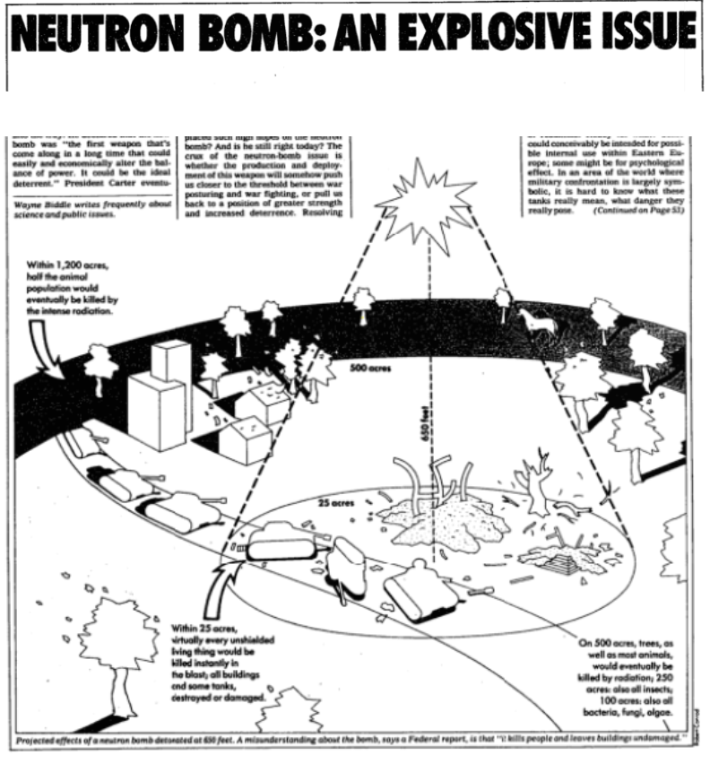
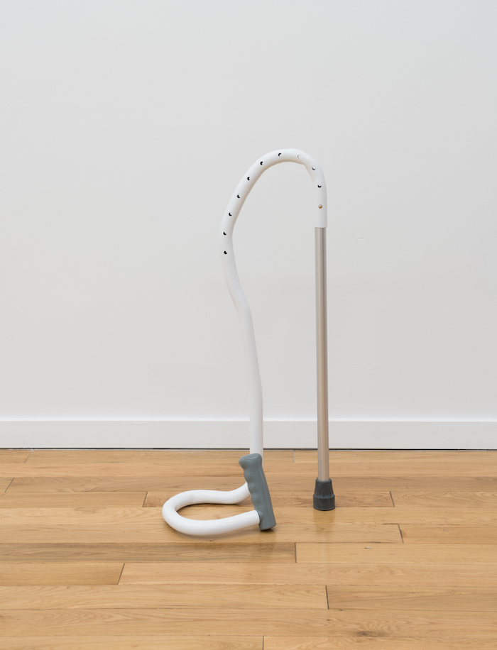
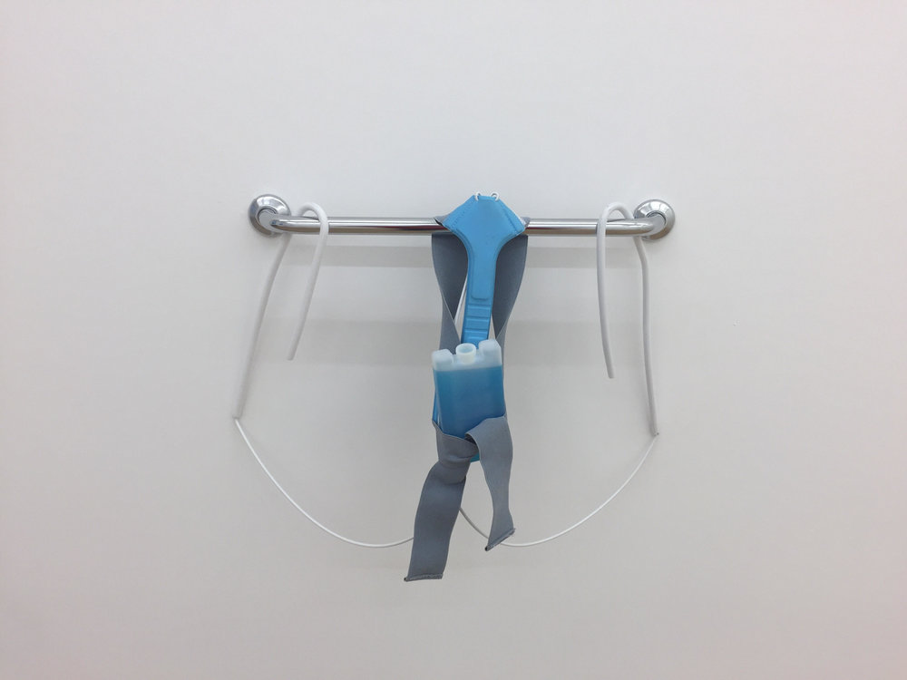
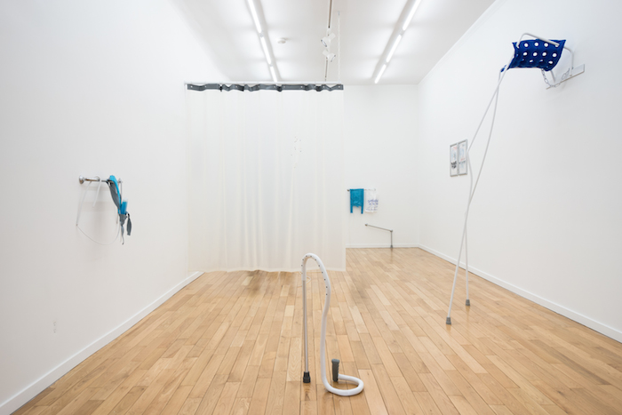
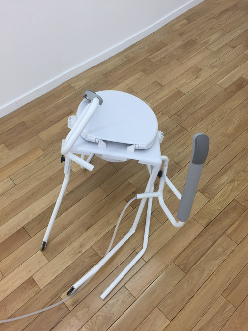
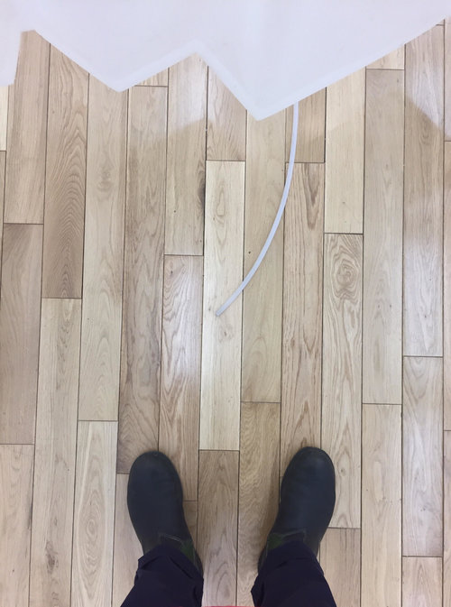
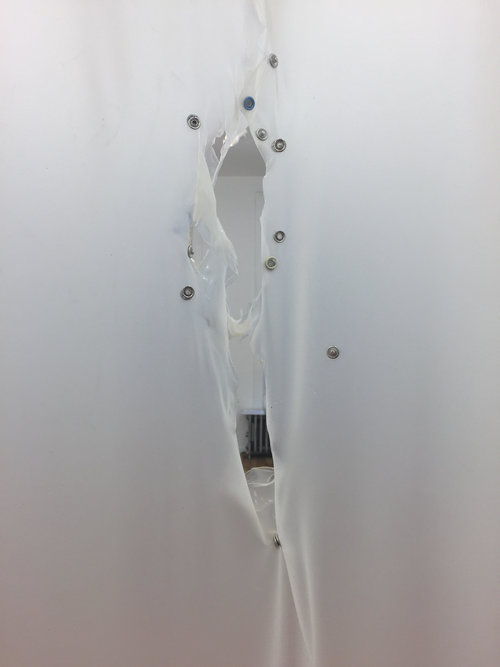
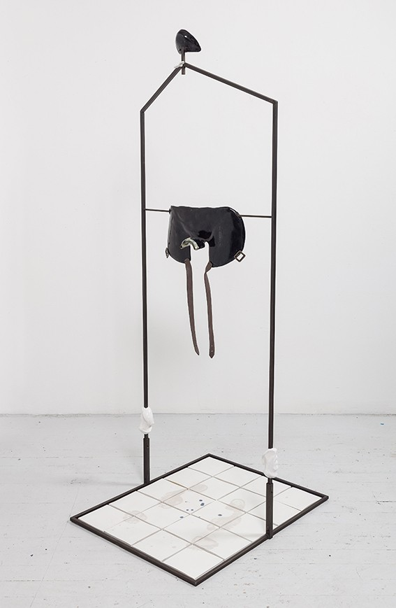
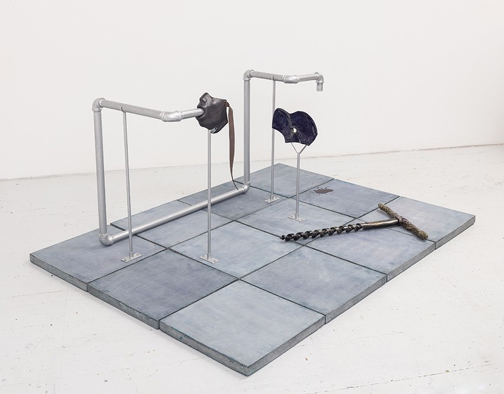

In certain city spaces during certain times of day—usually very early in the morning before the sun has risen—I sometimes think of the neutron bomb. I am, of course, not really thinking about the bomb's chemical properties or how it would likely behave if deployed, but instead of its lasting place in the cultural imaginary and its potency in realms like science-fiction fantasy: the nuclear weapon that would kill human populations while leaving buildings and other infrastructure undamaged. These morbid (and entirely self-centered) apocalyptic fantasies are easy to entertain before the day has really begun and you're waiting for public transportation that will seemingly never arrive and there is no sign of human or animal life anywhere in your sightline.

I felt this way, too, last month at [Chapter NY](http://chapter-ny.com/) on the Lower East Side. The first time I visited the newly-relocated gallery was during one of early March's last-gasp snowstorms, this one dumping the kind of dispiriting wet snow that makes branches and umbrellas sag. I left work early and headed over in the miserable slush an hour or two before the gallery was set to close, but when I got there, the lights were dim from the outside and no one answered my insistent buzzing. I finally accepted that the city was beginning to observe a snow day, and went to a diner next door to mope over matzo ball soup. On my way back home that evening, the normally impossible sidewalks had emptied themselves of human and canine presence.

A diagram that ran alongside "Neutron Bomb: An Explosive Issue" in <a href="https://www.nytimes.com/1981/11/15/magazine/neutron-bomb-an-explosive-issue.html">a November 1981 issue of the <i>New York Times</i>.</a>

When I made it back to Chapter a few days later (sunny, no snow in sight) to catch Jesse Darling's installation *Support Level* before it closed, I was surprised to feel, at first, the persistence of that same vacated mood. Then again, this might be a good time to mention that it's rare that I *don't* feel this way entering a gallery: their buzzers and emptiness and creaky floors and backroom offices more often than not imbue the space with the feeling of absence, or an unfriendly kind of presence. After a few quiet moments in the company of Darling's funny sculptural objects, however, *Support Level* felt very full.

Darling's sculptures—whose labels list materials like "back brace, mild steel, lacquer, grip bar, cool pack"—are almost creaturelike in their playfulness. They crouch and puddle. In their installation at Chapter—with a partially torn translucent curtain dividing the space and tubes leading to nowhere snaking on the ground—they seem to speak to one another in a language we cannot hear. Darling uses the visual and material language of the medical-industrial complex, from the one-size-fits-all cane to the wall-mounted assistance bar that awkwardly guesses at how the human body will interact with it, to create an animated sort of sculptural field.

Jesse Darling, <i>Collapsed Cane</i>, 2017. Steel, aluminum, rubber, and lacquer.

The *Support Level* [press release](http://chapter-ny.com/exhibitions/past/jesse-darling/) reads that Darling "draws from the clinical as a structural and social form of abjection," continuing, "A commode chair crawls along the floor, as a hygiene curtain reveals a gaping wound; health advice posters in asemic script hang with uncertainty, over-painted as though vandalized—architectures of the care-industrial complex pressed, distressed, and in pain." While the physical descriptors here are true—the commode chair does crawl, and the torn curtain and scribbled-on posters do hang—I can't help but wonder at the gloom-and-doom interpretation presented here, and whether this language stems from the artist or the gallery. Darling certainly does not present a utopian vision of disability; their work seemingly exists in an alternate universe from that of artists like [Sue Austin](http://www.wearefreewheeling.org.uk/sue-austin-home) and [Alice Sheppard](http://alicesheppard.com/), both of whom regard mobility devices as liberatory and image them as such in their work. (I was unaware of both of these artists prior to a presentation by Timothy Hiles at a panel called ["Disability Aesthetics and Choreopolitics"](https://conference.collegeart.org/programs/disability-aesthetics-and-choreopolitics/) at the 2018 CAA Conference.) At the same time, part of what's so compelling about Darling's work is its strange and critical kind of optimism or hopefulness. Darling seems committed to using the material of our broken healthcare systems against itself, revealing the system's own weak joints. Here, disability and illness are presented not as sites of utter abjection but as frustrations that enable points of departure and occasions to imagine how our lives might be otherwise if our systems of care did not consistently fail us.

Jesse Darling, <i>Plexus</i>, 2017. Back brace, mild steel, lacquer, grip bar, cool pack.

Though the objects in the room are mostly devoid of figuration (with the exception of one drawing from the _waiting room poster/municipal hospital_ series, depicting a footless figure pregnant with a question mark), their presence evokes the human regardless. This evocation stretches backward and forward in time simultaneously: the sculptures map the ways in which human bodies may (or may not be able to) interact with them at a future moment, but are also indexes of past human action against them. Each time the objects begin to feel antagonistic toward their material, there is a moment when you catch an angle that almost makes you laugh (a bend, a squat), and it begins to feel like these sculptures have been rendered with a kind of resentful tenderness, like the maker knows these medical artifacts cannot escape their own pathetic and inadequate qualities. Humans lurk everywhere just outside the metaphorical frame of these works. It's funny how some of the most telling signifiers of human abandonment—like smashed-in or boarded-up windows, or graffiti, as rendered here by Darling over or in place of educational health posters—are also the traces of the human hand. If the neutron bomb were dropped, it too would leave its own unmistakably manmade markers of absence.

In another quiet corner of a different New York institution, the New Museum, Julia Phillips' sculptures silently unsettle. Phillips' sculptural apparatuses are featured in the 2018 New Museum Triennial, *[Songs for Sabotage](https://www.newmuseum.org/exhibitions/view/2018-triennial-songs-for-sabotage).* As Magdalyn Asimakis writes in the exhibition's catalogue, Phillips' sculptures are dismantled and put back together each time they are shipped and re-exhibited, "challenging installers to piece together the counterintuitive structures" and "reconsider the potentials of their own bodies." This, I think, is equally true for the average onlooker as it is for the art handler: the definitive signifiers and traces of the body are present, but how, exactly, does a body fit here, does a body use this? In this way, Phillips' sculptures resonate strongly with Darling's; both instantiate a kind of bodily projection in which the viewer can't help but wonder how she would or would not be able to interact with the object at hand.

Julia Phillips, <i>Fixator (#2)</i>, 2017. Partially glazed ceramics, metal screws, metal structure, and partly glazed ceramic tiles.

Phillips' structures, too, evoke the realm of the medical-industrial complex, but unlike the sanitized, standardized contemporary hospital room whose materials Darling uses, Phillips mines the connotative field of what we'd now consider outdated. Her spare and frankly frightening sculptures call to mind backroom abortions, electroshock therapy, so-called insane asylums, and any number of eugenics-related activity. In short, Phillips' work is disciplinary in tone and material. Though there seem to be dildos and harnesses everywhere, even these evoke circumcision or castration more so than rough pleasure. These sculptures cannot, I think, be construed as whimsical or pathetic. They are sure and steady and capable of inflicting harm—if, that is, a person chooses to animate them.

What these works do share in common with those displayed in _Support Level_, though, is the same human figure lurking just outside the frame, perhaps neutron-bombed out of existence. (Though it's been said over and over that the kills-people-but-leaves-structures-intact concept is a misunderstanding, I still have faith that if a neutron bomb were dropped near Jesse Darling's and Julia Phillips' works, they would withstand the blow. Like cockroaches, the dreadful material of hospitals and doctors' offices are seemingly indestructible and will long outlast us.) In Phillips' *Fixator (#2)*, pictured above and featured in the Triennial, footprints mark the ceramic tiles of the sculpture's base, accompanied by twin splotches above the footprints and gray paint-drips between them. Though not all of Phillips' work so clearly demarcates the past presence of a human figure (and, as with Darling, the potential for a future presence as well), with titles like _Tuner, Protector, Observer,_ and _Intruder_, her work clearly brackets off space for the active presence of human bodies.

Julia Phillips, <i>Extruder (#1)</i>, 2017. Partially glazed ceramics, screws, metal structure, metal pipes, concrete tile, lacquer.

What's most useful, I think, in looking at the work of Jesse Darling and Julia Phillips side-by-side is precisely the stark difference in their choice of material. Darling's antiseptic tubes and pipes would balk at the kind of medical milieu pictured in Phillips' structures, on which footprints and other traces of the body leave their lasting marks. And yet we benefit from reconfiguring the temporality of these works through this comparison; we are helpfully forced into a more critical place in thinking of these very different kinds of sculptures as picturing two points on the spectrum of the very same medical regime. I myself am pushed by this comparison to think twice about my characterization of Darling's sculptures as "playful" when indeed I would never apply the same descriptor to Phillips'. When we look at Darling's work in comparison to Phillips', we can easily see it as disinfected and neutralized, but it behooves us as viewers to trouble this distinction. It becomes clear, I think—and hope—that the site of abjection in both bodies of work is not rooted in the individual body per se, but rather in the manmade systems that mark off the othered body as such and forcefully attempt to straighten it.

---

**Of note:**

Jessica Cooley and Ann M. Fox, ["Disability Art, Aesthetics, and Access: Creating Exhibitions in a Liberal Arts Setting,"](http://dsq-sds.org/article/view/3288/3530) *Disability Studies Quarterly* 34, no. 1 (2014): a conversation between curators about some of the ethics and logistics of curating so-called disability art. For all the strengths of Jesse Darling's installation at Chapter NY, the gallery, as far as I could tell, failed to meet a bunch of ADA requirements; it was difficult to see how the majority of physically handicapped folks would access the work on view.

Julia Phillips' first solo museum exhibition, *[Failure Detection](https://www.moma.org/calendar/exhibitions/3925?locale=en),* opens April 15 at MoMA PS1.
