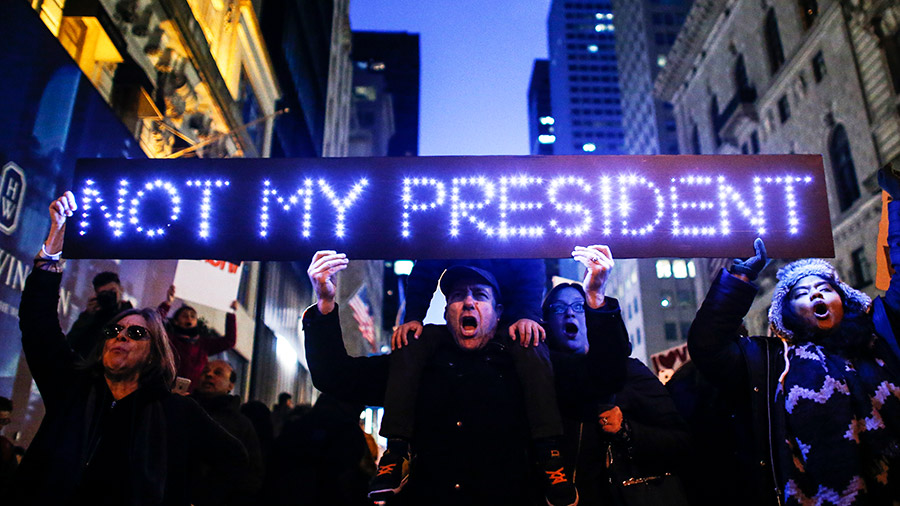

On a recent walk around West Philadelphia, I came across a sign stuck in the cold dirt of someone's front yard, which read THIS NEIGHBORHOOD RESPECTS WOMEN. Before and since the election of Donald Trump last November, signs of this sort have cropped up all over the various public spaces I inhabit, with messages ranging from HILLARY 2016 and LOVE TRUMPS HATE to BLACK LIVES MATTER, STOP PROFILING MUSLIMS and FUCK TRUMP. There was, however, something distinct about the proclamation that the neighborhood as a whole "respects women."

Of course, I'd like it to be true. Only a week before encountering this sign and two blocks away from where it was planted like a premature seedling, I'd watched as a cop cruelly slammed the body of a girl no older than twenty against the trunk of his car, yelling at she and her mother who stood nearby, making a spectacle of them both. I've been the recipient of and witnessed street harassment on these sidewalks, as I have in every place I've ever lived. What's more, though, the sign implies—or attempts to construct—a static neighborhood, a place where meaning crystallizes and residents stand as one in a united ethical front.

This kind of thinking belies the constant movement of bodies and objects in and out of public space that actually constructs a neighborhood. From the large-scale migrations that constitute gentrification and white flight to the random comings and goings of wanderers and restaurant-goers and people without homes and walkers of dogs (and, and, and), the only constants within urban space are change and motion, though the creator of this sign might have other hopeful commonalities in mind. As protest signs have become more visible lately than they've ever been in my lifetime, I've been considering the logic of their syntax and the publics they conjure in their various addresses.

Since November—both in person and online—I've noticed an increasing number of protest signs that use the same syntactic logic as THIS NEIGHBORHOOD RESPECTS WOMEN. And since the protest sign more than ever exists in and as meme, these messages were reproduced and disseminated on a large scale, creating an impressionistic image of which sentiments have the broadest reach and greatest popular appeal. It seems that the most popular signs have a) directly borrowed from the language of politicians (namely, Trump), b) used the syntax of optimistic untruth seen in THIS NEIGHBORHOOD RESPECTS WOMEN, or (and often), c) both.

Perhaps the most visible and widely circulated of these messages has been the phrase NOT MY PRESIDENT, which has circulated as protest sign, as hashtag, and as organizing tactic (["Not My Presidents Day" protests](http://www.usatoday.com/story/news/politics/2017/02/19/donald-trump-not-my-presidents-day-protests/98130952/), February 20, 2017), contests Trump's position and reinscribes it simultaneously. It points backward toward one's prior political engagement—_I didn't vote for Trump_, these signs say, or _I did not or cannot vote_—and forward toward a speculative and hoped-for future in which Trump is no longer in office. What the statement NOT MY PRESIDENT cannot do is address the present moment or conjure communal resistance, since it both refutes the fact of reality and allows its user to discretely withdraw from a political commons (i.e., "he may be *your* president, but he's not _mine_").

In other popular signage, too, the creator and carrier of the sign restates basic untruths in service of a future that stands against recorded history:

OUR RIGHTS AREN'T UP FOR GRABS
MY PUSSY, MY RULES
I CAN DO WHATEVER I WANT
MY UTERUS IS PRIVATE PROPERTY
A SEXUAL PREDATOR CANNOT BE PRESIDENT

These statements range from contextually dependent to factually untrue. In the picture I found of the I CAN DO WHATEVER I WANT sign, its carrier was a grinning white woman; imagining a woman of color confidently making that same statement is hard to do. Residing in a grey area outside either an indictment of current circumstances or demands for a better future, these signs twist language bizarrely, somehow wringing it of political efficacy. In my head I imagine all these signs and their holders rounded up into a separate march, one in which their sentiments cheerfully affirm the inviolability of their bodies and the purity of their elected officials: a happy protest indeed.

In advance of an exhibition called [_Queer Voice_](http://icaphila.org/exhibitions/1714/queer-voice) at the Institute of Contemporary Art in 2010, the curator contacted over eighty individuals with a short prompt: "describe the queer voice." In what's perhaps my favorite answer, curator Naomi Beckwith responded with the following:

Any voice is queer to the untrained ear. Foreign languages are incomprehensible to the non-native speaker, accents scramble languages in which one considers oneself fluent. The queer voice is a cognitive disjunction more so than a sonic one. We think a voice queer when it doesn't match the body from which it emanates; it's an autonomous disembodied sound made surreal like ventriloquism...the queer voice is the prismatic view of the body we thought we understood.

Beckwith's definition is translated beautifully into embodied speech acts in the work of artist Sharon Hayes (also one of the artists featured in _Queer Voice_). Hayes's practice resides in the moment of cognitive disjunction, of the mismatching of body and voice.

In a series of performances entitled *In the Near Future,* which spanned from 2005 to 2009, Hayes stood alone in public space in New York (and, later, in various European cities) with signs dug up from protests past. The messages Hayes chose ranged from anachronistic ("Ratify E.R.A. Now!," "Who Approved the War in Vietnam??"), referring to a specific time and place within past politics, to sentiments more diffusely connected to history ("Nothing Will Be As Before," "We Are Innocent").

One of the images that circulates most widely from [_In the Near Future_](https://www.guggenheim.org/artwork/26692) is of Hayes holding a sign that reads I AM A MAN. In the documentation of the ongoing performance, this one is an outlier: the picture shows Hayes in what might be a confrontation with two police officers, and the sign itself uses the first-person voice and refers back to Hayes's body in a way that none of the other signs do. The phrase itself, and its stylization, has itself circulated widely throughout the past fifty years: it originated with [the strike of 1,300 black sanitation workers in Memphis in 1968](http://crdl.usg.edu/events/memphis_sanitation_strike/?Welcome), picked up by Glenn Ligon in his 1988 painting *Untitled (I Am a Man),* then again by Hayes in 2005 and Dread Scott in his 2009 performance _I Am Not a Man._

In this lineage, Hayes is the only white person and the only woman to appropriate this imagery. To reiterate Naomi Beckwith's queer voice prompt, "we think a voice queer when it doesn't match the body from which it emanates." Hayes's gesture here appears an absurd, a queer, rupture in public space. Held by a woman, meaning shifts from civil rights on the basis of race to that of gender. Hayes stands alone, and silently—except when approached, at which point she does engage conversation with pedestrians who ask her questions—but her sign is insistent, implanting a speech act even where there is no audible speech.

It's a very uncomfortable experience to look at this white woman reframing a piece of black history, and yet each time I've come across this image I've looked for a long time. It's this discomfort that I think is the most productive part of being a viewer of _In the Near Future._  It does remind me of [a protest sign](http://fusion.net/story/382776/amir-talai-viral-photo-womens-march-nice-white-ladies-black-lives-matter/) that circulated in the aftermath of the Women's Marches in January 2017: it read, "I'll see you nice white ladies at the next #BlackLivesMatter march, right?"

It was a brilliant sign in how pithily it indicted white attention and care and the respectability politics of certain forms of resistance as opposed to others. And then, just as quickly as it emerged on social media and was liked and reposted and celebrated, it was revealed that its carrier was a man. Suddenly, what looked like allyship and accountability began to uncomfortably resemble something else: was it condescension? Misogyny?

There's been a lot of talk about what politics can do that art can't, but at the moment I'm interested in specific tactics that open up artistic production as a site of action. In the wake of the election, there seemed to be a call to arms to artists to keep producing in a continual act of resistance against the coming administration. Art was addressed aesthetically, in terms of its ability to bring beauty into an ugly world (important), as well as in terms of its representational abilities (also important). What I thought was missing there was attention paid toward practices like Sharon Hayes', in which the work is neither beautiful nor representational (nor, arguably, easily commodifiable).

In the realm of politics, a one-person protest is a failure. Shifted to a different context, Hayes's solo demonstrations open up possibilities that the millions-strong Women's Marches never could. The language of those large-scale protests, by and large, drew upon the recent soundbytes of politicians and rebuked them—or attempted to—by conjuring a speculative (unlikely?) future in which conditions on the ground are much different, and much better, than they are now.

Hayes's queer (in every sense of the word) performances extract dormant language from its historical contexts, pulling it into the present moment. This is, as Beckwith says, "a cognitive disjunction more so than a sonic one." The disjunction happens not only on the level of embodiment—the specificities of Hayes's body against the specificities of language—but on the level of temporality, the friction created when time passes and we are forced to reckon with its remains. All these speech acts from Hayes and not a single chant, a single shout.

In a 2009 interview with Julia Bryan-Wilson, Hayes remarked, "As an artist, I'm not willing to concede the space of politics to politicians and reporters and FOX News and CNN. I'm not willing to relinquish participation in the production of the cultural imagination around politics."

If art is to continue to hold a space for itself within the realm of politics, it needs to be willing to deconstruct not only the content of politics—what's being said, Trump's latest destructive remark or policy—but how and for whom language functions. It needs to make room for indeterminate speech acts and actions like Hayes's, wherein it's not entirely clear what's happening and why. It needs to carve out time and space for the kinds of interactions made possible by Hayes's demonstrations, in which she meets her audience literally on the ground, in quiet, one-on-one, unscripted conversations. It needs to find a way to do this so that the realms of pure aesthetics and pure representation do not go uncontested or unaccompanied.

---

**Of note:**

When I first encountered this New York Times overview of the events of January 21st, ["Pictures From Women's Marches on Every Continent,"](https://www.nytimes.com/interactive/2017/01/21/world/womens-march-pictures.html?_r=0) it made me unexpectedly emotional. When I revisited it while writing this, I noticed other things: for example, the highlighted picture from protests in Buenos Aires, Argentina, featured a woman holding a sign that said, among other things, "Not My President." There's another kind of disjunction happening here, involving borders and globalization and mass media, that probably a whole other post could be devoted to.

[Contemporary Art Gallery, Vancouver](https://vimeo.com/23971715): more from Hayes herself about _In the Near Future_ and how documentation of the performances function in an exhibition (and why slide projectors are the perfect materiality for reshowing this work).

Brooke Obie, ["Woman in Viral Photo From Women's March to White Female Allies: 'Listen to a Black Woman,'"](http://www.theroot.com/woman-in-viral-photo-from-women-s-march-to-white-female-1791524613) The Root. This is an interview with Angela Peoples, whose staging of her protest sign ("Don't forget: White Women Voted for Trump") quickly went viral after the Women's Marches. Another interesting moment from this day where the meaning of language and the meaning of bodies created productive tension.
